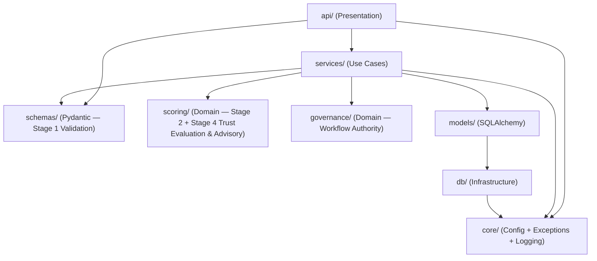

# 01 — Project Structure

> **Winnow** — QA framework for user submitted data in citizen science projects

This document defines the target directory layout for the FastAPI microservice. The structure follows **Clean Architecture** principles: dependencies point inward, and every layer has a single, well-defined responsibility.

**Terminology convention:** In Winnow, *"Validation"* refers exclusively to **Stage 1** — structural and technical checks enforced by Pydantic schemas (types, ranges, required fields). *"Scoring"* refers to **Stage 2** (Confidence Score calculation). *"Trust Evaluation & Advisory"* refers to **Stage 4** — using the client-provided trust level as a scoring input (Tₙ) and computing a `trust_adjustment` recommendation based on ground-truth finalization signals. *"Governance"* refers to Winnow's role as the **authoritative engine** for the validation workflow: it owns the submission lifecycle state, determines review requirements, and orchestrates which submissions are eligible for review by whom. The directory layout below reflects this separation.

### Domain Ownership Principle

| Concern | Owner | Rationale |
|---|---|---|
| **Domain Data** (trees, species, measurements, photos) | Laravel (client) | The client project owns its entities and business objects. |
| **Validation Process State** (submission status, review requirements, task eligibility) | **Winnow** | Winnow is the single source of truth for the QA workflow. The client renders whatever Winnow permits. |
| **User Identity & Trust Level** | Laravel (client) | The client owns users and their trust. Winnow receives trust on the wire and returns advisory deltas. |
| **Scoring Results & Audit Trail** | **Winnow** | Immutable submission snapshots, scores, and finalization history. |

---

## Directory Tree

```text
winnow/
│
├── app/                            # ← Application root (Python package)
│   ├── __init__.py
│   ├── main.py                     # FastAPI application factory & lifespan
│   ├── bootstrap.py                # Startup bootstrap — fault-tolerant auto-discovery of ProjectBuilders
│   │
│   ├── api/                        # Presentation layer — HTTP interface
│   │   ├── __init__.py
│   │   ├── deps.py                 # Shared FastAPI dependencies (get_db, get_current_project…)
│   │   ├── errors.py               # RFC 7807 Problem Details exception handlers
│   │   └── v1/                     # API version namespace
│   │       ├── __init__.py
│   │       ├── router.py           # Aggregated APIRouter for v1
│   │       ├── submissions.py      # POST  /submissions, PATCH /withdraw, PATCH /override
│   │       ├── tasks.py            # GET   /tasks/available           — query reviewable submissions (governance)
│   │       ├── voting.py           # POST  /submissions/{id}/votes    — Governance Engine threshold evaluation
│   │       ├── results.py          # GET   /results                  — query scoring outcomes
│   │       └── health.py           # GET /api/v1/health (canonical) + GET /health (infra alias)
│   │
│   ├── schemas/                    # Pydantic V2 models — API contracts & Stage 1 validation
│   │   ├── __init__.py
│   │   ├── envelope.py             # SubmissionEnvelope, UserContext, generic payload wrapper
│   │   ├── results.py              # ScoringResultResponse, ScoreBreakdown response models
│   │   ├── errors.py               # ProblemDetail schema (RFC 7807)
│   │   └── projects/               # Project-specific payload schemas (Stage 1 validation)
│   │       ├── __init__.py
│   │       └── trees.py            # TreePayload — enforces completeness, types & ranges
│   │                               #   via Pydantic Field constraints (e.g. height > 0,
│   │                               #   le=150, required photos ≥ 2, lat/lon bounds, etc.)
│   │
│   ├── models/                     # SQLAlchemy 2.0 ORM models — database layer
│   │   ├── __init__.py
│   │   ├── base.py                 # Declarative base, common mixins (UUID pk, timestamps)
│   │   ├── submission.py           # Root anchor (stores envelope + raw payload as JSONB)
│   │   ├── submission_user_snapshot.py # Snapshot of user state (role, trust) at submission time
│   │   ├── scoring_snapshot.py     # Technical analysis output (1:N for re-scoring)
│   │   ├── status_ledger.py        # Append-only SSOT for submission status and trust deltas
│   │   ├── submission_vote.py      # Reviewer votes for threshold evaluation
│   │   ├── project_config.py       # ProjectConfig table (weights, thresholds, governance rules per project)
│   │   └── webhook_outbox.py       # Transactional Outbox for async notifications
│   │
│   ├── services/                   # Business / application logic (use cases)
│   │   ├── __init__.py
│   │   ├── scoring_service.py      # Orchestrates Stage 1 → Stage 2 → Stage 4 pipeline
│   │   ├── submission_service.py   # Receives envelope → persists → triggers scoring
│   │   ├── governance_service.py   # Task orchestration — determines review requirements & eligible reviewers
│   │   ├── voting_service.py       # Manages vote casting, eligibility, and threshold evaluation
│   │   └── webhook_service.py      # Manages webhook delivery and outbox polling
│   │
│   ├── registry/                   # Top-level registry domain — wires schemas, scoring & governance
│   │   ├── __init__.py             # Re-exports: ProjectRegistryEntry, ProjectBuilder, registry
│   │   ├── base.py                 # ProjectBuilder ABC — interface every project must implement
│   │   ├── manager.py              # Registry singleton + ProjectRegistryEntry dataclass
│   │   └── projects/               # One ProjectBuilder subclass per registered project
│   │       ├── __init__.py
│   │       └── trees.py            # TreeProjectBuilder — composer for tree-app (schemas+rules+governance)
│   │
│   ├── scoring/                    # Domain layer — pure scoring rules only (no registry knowledge)
│   │   ├── __init__.py
│   │   ├── base.py                 # Abstract base: ScoringRule protocol / ABC
│   │   ├── pipeline.py             # ScoringPipeline — iterates rules, aggregates weighted scores
│   │   ├── common/                 # Generic scoring rules reusable across all projects
│   │   │   ├── __init__.py
│   │   │   ├── trust_level.py      # Tₙ — User trust-level scoring factor (Stage 4 input)
│   │   │   └── trust_advisor.py    # Trust Advisor — computes trust_adjustment deltas (Stage 4 output)
│   │   └── projects/               # Project-specific scoring rule sets
│   │       ├── __init__.py
│   │       └── trees/              # Scoring rules for the tree-tracking project
│   │           ├── __init__.py
│   │           ├── height_factor.py        # Hₙ — height normalisation
│   │           ├── distance_factor.py      # Aₙ — measured vs. estimated step length
│   │           ├── plausibility_factor.py  # Pₙ — species-typical deviation
│   │           └── comment_factor.py       # Kₙ — comment-based penalty
│   │
│   ├── governance/                 # Governance layer — workflow orchestration (the authority)
│   │   ├── __init__.py
│   │   ├── base.py                 # Abstract GovernancePolicy — defines review requirements
│   │   └── projects/               # Project-specific governance policies
│   │       ├── __init__.py
│   │       └── trees.py            # Tree-app governance: review tiers by score & trust
│   │
│   ├── db/                         # Database infrastructure
│   │   ├── __init__.py
│   │   ├── session.py              # Async engine + sessionmaker (asyncpg)
│   │   └── migrations/             # Alembic migrations root
│   │       ├── env.py
│   │       ├── alembic.ini
│   │       └── versions/           # Auto-generated migration scripts
│   │
│   ├── core/                       # Cross-cutting application configuration
│   │   ├── __init__.py
│   │   ├── config.py               # Pydantic Settings (DATABASE_URL, DEBUG, PROBLEM_BASE_URI, …)
│   │   ├── exceptions.py           # Domain exception hierarchy (WinnowError, ProjectNotFoundError, …)
│   │   └── logging.py              # Structured JSON logging (python-json-logger)
│   │
│   └── tests/                      # Pytest test suite (mirrors app/ structure)
│       ├── __init__.py
│       ├── conftest.py             # Fixtures: session-scoped bootstrap, async test client, test DB session
│       ├── api/
│       │   └── test_submissions.py
│       ├── services/
│       │   └── test_scoring_service.py
│       └── scoring/
│           ├── test_common_rules.py
│           └── test_tree_rules.py
│
├── docs/                           # Documentation (this folder)
│   ├── architecture/               # Architecture Decision Records & design docs
│   ├── design_docs/                # Typst source & PDFs (thesis prep work)
│   └── tree_db/                    # Laravel migration reference files
│
├── pyproject.toml                  # Project metadata, dependencies (uv / pip)
├── uv.lock                         # Reproducible lock file
├── Dockerfile                      # Multi-stage build (dev / prod)
├── compose.yaml                    # Production stack (API + Caddy)
├── compose.dev.yaml                # Dev overrides (hot-reload, exposed ports)
├── Caddyfile                       # Reverse-proxy & auto-TLS config
├── .env.example                    # Template for environment variables
└── README.md
```

---

## Stage Mapping to Directories

| Stage | Concern | Where in the codebase |
|---|---|---|
| **Stage 1 — Validation** | Schema correctness, types, required fields, range bounds, completeness | `app/schemas/` — especially `app/schemas/projects/*.py` (Pydantic `Field` constraints) |
| **Stage 2 — Scoring** | Confidence Score factors: Hₙ, Aₙ, Pₙ, Kₙ | `app/scoring/projects/` (domain-specific `ScoringRule` implementations) |
| **Stage 4 — Trust Evaluation & Advisory** | Dual role: (a) use client-provided `trust_level` as scoring input Tₙ, (b) compute `trust_adjustment` recommendation after ground-truth finalization | `app/scoring/common/trust_level.py` (Tₙ factor), `app/scoring/common/trust_advisor.py` (delta computation) |
| **Governance** | Determine review requirements ("Target State"), filter eligible tasks per reviewer trust level, own the validation workflow lifecycle | `app/governance/` (policies), `app/services/governance_service.py` (orchestration) |

> **Stage 1 is the gatekeeper.** If the payload fails Pydantic validation, the request is rejected with a `422` error *before* any scoring rule is invoked. This keeps scoring rules clean — they can safely assume that the data they receive has already passed all structural checks.

### Finalization & Trust Advisory Flow

The scoring pipeline (Stages 1 → 2 → 4-input) runs synchronously on submission. However, **the Trust Advisor's recommendation** (Stage 4 output) is only computed after the client sends a **ground-truth finalization signal** — i.e., when a human expert or the community confirms the final verdict (approved / rejected).

| Phase | Trigger | Result |
|---|---|---|
| **Initial scoring** | `POST /api/v1/submissions` | Confidence Score, `required_validations` (Target State), initial status (`pending_review`, `approved`, or `rejected`) |
| **Task query** | `GET /api/v1/tasks/available?user_trust=X` | Submissions eligible for review by a user with the given trust level |
| **Voting & Finalization** | `POST /api/v1/submissions/{id}/votes` | Reviewer decision recorded; threshold evaluation auto-triggers status change + `trust_adjustment` |

---

## Layer Responsibilities

### `app/api/` — Presentation Layer

| Concern | Detail |
|---|---|
| **Role** | Accepts HTTP requests and returns HTTP responses. |
| **Contains** | Route handlers, dependency injection (`Depends`), request/response mapping. |
| **Rule** | No business logic here. Handlers call into `services/` and return `schemas/` models. |

### `app/schemas/` — API Contracts & Stage 1 Validation (Pydantic V2)

| Concern | Detail |
|---|---|
| **Role** | Define the shape of data that crosses the API boundary **and** enforce Stage 1 validation. |
| **Contains** | Pydantic `BaseModel` classes. Strictly **no** SQLAlchemy imports. |
| **Key file** | `envelope.py` — implements the **Envelope Pattern** (see `03_api_contracts.md`). |
| **`projects/` sub-folder** | Each project registers its own payload schema here. These schemas enforce **all Stage 1 checks**: required fields (completeness), type correctness, range constraints (e.g., `height: float = Field(gt=0, le=150)`), and structural rules (e.g., `photos: list[TreePhoto] = Field(min_length=2)`). |

### `app/models/` — Persistence Layer (SQLAlchemy 2.0)

| Concern | Detail |
|---|---|
| **Role** | Map Python objects to PostgreSQL tables. |
| **Contains** | SQLAlchemy `Mapped` classes. Strictly **no** Pydantic imports. |
| **Immutability** | Follows an **append-only** pattern. Submissions are never updated; status changes are recorded as new entries in the `status_ledger` using the backward-pointer supersession pattern. |
| **Rule** | Models are always separated from schemas to avoid tight coupling between API shape and DB schema. |

### `app/services/` — Application / Use-Case Layer

| Concern | Detail |
|---|---|
| **Role** | Orchestrate domain operations: receive a submission, run Stage 1 validation via the registry's Pydantic schema, trigger the Stage 2 + Stage 4 scoring pipeline, determine governance requirements, persist results, process voting signals, and serve task queries. |
| **Contains** | Stateless service functions or thin classes that coordinate `scoring/`, `governance/` rules and `models/` persistence. |
| **Key files** | `scoring_service.py` — resolves the project config from the registry, validates the raw payload against the project-specific Pydantic schema (Stage 1), then passes the validated object to the `ScoringPipeline` (Stage 2 + Stage 4 input). After scoring, invokes the governance policy to compute `required_validations`. `voting_service.py` — manages reviewer votes, enforces eligibility, and evaluates thresholds for automated finalization. `governance_service.py` — queries eligible tasks for a given trust level using the project's governance policy. `webhook_service.py` — ensures guaranteed delivery of state-change notifications. |
| **Rule** | May depend on `scoring/`, `governance/`, `models/`, `schemas/`, `core/`; must **not** depend on `api/`. Services raise domain exceptions from `core/exceptions.py` — never `fastapi.HTTPException`. |

### `app/registry/` — Registry Domain (Project Composer)

| Concern | Detail |
|---|---|
| **Role** | The single top-level domain that wires together schemas, scoring rules, and governance policies for each registered project. Decoupled from all three sub-domains it composes. |
| **Contains** | `ProjectRegistryEntry` dataclass, `Registry` singleton, `ProjectBuilder` ABC, and one concrete `ProjectBuilder` per project under `projects/`. |
| **Key abstraction** | `ProjectBuilder` (Open/Closed): adding a new project means creating a new subclass in `registry/projects/` — `bootstrap.py` auto-discovers and loads it, no existing code changes required. |
| **Rule** | No HTTP, no DB imports. The registry is populated at startup by `bootstrap.py` and consumed by services via dependency injection. |

### `app/bootstrap.py` — Startup Bootstrap

| Concern | Detail |
|---|---|
| **Role** | Auto-discovers and loads all active `ProjectBuilder` instances at application startup using `pkgutil`, `importlib`, and `inspect`. Scans every module in `app.registry.projects`, finds concrete `ProjectBuilder` subclasses, and calls `registry.load(builder)` for each. |
| **Usage** | Must be **explicitly called** — does **not** execute on import. In production, call `bootstrap()` inside the FastAPI `lifespan` context manager in `main.py`. In tests, call it once via a session-scoped `autouse` fixture in `conftest.py`. |
| **Fault-tolerance** | Every module import and every `registry.load()` call is individually wrapped in `try/except`. A broken or misconfigured project builder is logged and skipped; all remaining projects continue to load. A single bad file can never crash the entire application. |
| **Rule** | Adding a new project = create `app/registry/projects/<name>.py` with a `ProjectBuilder` subclass. `bootstrap.py` requires **no changes**. See `02_architecture_patterns.md § 3b` for the full auto-discovery flow. |

### `app/scoring/` — Domain Layer (Scoring Core)

| Concern | Detail |
|---|---|
| **Role** | Houses all **scoring rules** (the "strategies") and the pipeline that runs them. This is the Confidence Score engine. |
| **Contains** | An abstract `ScoringRule` base, the `ScoringPipeline`, and concrete rule implementations. The registry has been extracted to `app/registry/`. |
| **Sub-folders** | `common/` for reusable scoring factors (e.g., `trust_level.py` for Tₙ input, `trust_advisor.py` for Stage 4 advisory output), `projects/<name>/` for domain-specific scoring rules. |
| **Rule** | Pure logic — no HTTP, no DB imports. Rules receive **validated** data (Pydantic model instances that already passed Stage 1) and return score components. |
| **Not here** | Completeness checks, range checks, type validation — these belong in `app/schemas/projects/` as Pydantic `Field` constraints (Stage 1). Governance decisions belong in `app/governance/`. |

### `app/governance/` — Domain Layer (Governance Authority)

| Concern | Detail |
|---|---|
| **Role** | Determines the **review requirements** ("Target State") for each scored submission and controls **task eligibility** — which submissions a reviewer of a given trust level may validate. Winnow is the single source of truth for the validation workflow. |
| **Contains** | An abstract `GovernancePolicy` base and project-specific policy implementations that encode rules like "score > 90% → needs 1 peer review; score < 50% → needs expert review". |
| **Key output** | A `RequiredValidations` object (min_validators, required_min_trust, required_role) that is included in the POST /submissions response and used by the task query endpoint. |
| **Rule** | Pure logic — no HTTP, no DB imports. Receives a `ScoringResult` and project config, returns governance metadata. |
| **Design intent** | By centralising "who is allowed to validate what" logic in Winnow, client projects (Laravel) are relieved from re-implementing this complex workflow. They act as **Task Clients** — rendering whatever Winnow permits. |

### `app/db/` — Database Infrastructure

| Concern | Detail |
|---|---|
| **Role** | Provide async SQLAlchemy engine, session factory, and Alembic migration environment. |
| **Contains** | `session.py` (engine + `async_sessionmaker`), Alembic config. |
| **Rule** | Single source of truth for connection management. All other layers obtain sessions via FastAPI `Depends`. |

### `app/core/` — Configuration & Cross-Cutting Concerns

| Concern | Detail |
|---|---|
| **Role** | Centralised application settings, logging setup, and any shared utilities. |
| **Contains** | `config.py` — `pydantic-settings` for environment variable validation. `exceptions.py` — domain exception hierarchy (`WinnowError` → `ProjectNotFoundError`, `NotImplementedYetError`). `logging.py` — structured JSON logging via `python-json-logger`. |

### `app/tests/` — Test Suite

| Concern | Detail |
|---|---|
| **Role** | Automated tests mirroring the source tree. |
| **Contains** | Pytest fixtures (`conftest.py`), unit tests for scoring rules and services, integration tests for API endpoints. |
| **Rule** | Uses an isolated test database (or SQLite in-memory for fast unit tests). |

---

## Dependency Flow

The following diagram shows the allowed import direction between layers. Arrows mean "depends on".



> **Key constraint:** `scoring/` and `governance/` have **zero** dependencies on `models/`, `db/`, or `api/`. This keeps the scoring engine and governance logic portable and testable in isolation. The `governance/` layer depends on scoring outputs (the Confidence Score) but not on scoring internals.
>
> **Exception flow:** Services raise domain exceptions from `core/exceptions.py` (`ProjectNotFoundError`, `NotImplementedYetError`). The `api/errors.py` handlers catch these and translate them to RFC 7807 `ProblemDetail` responses. The `fastapi` package is never imported by any service module.
