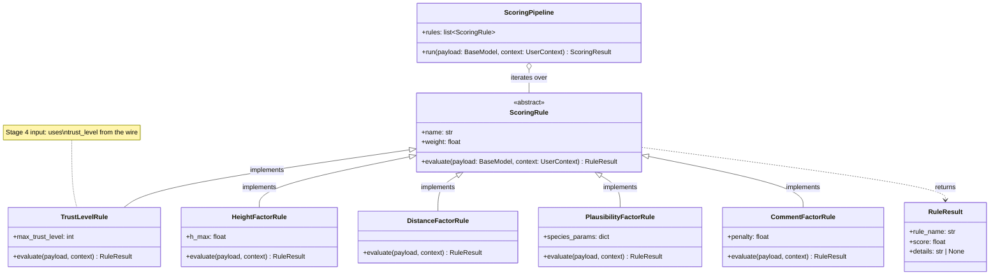
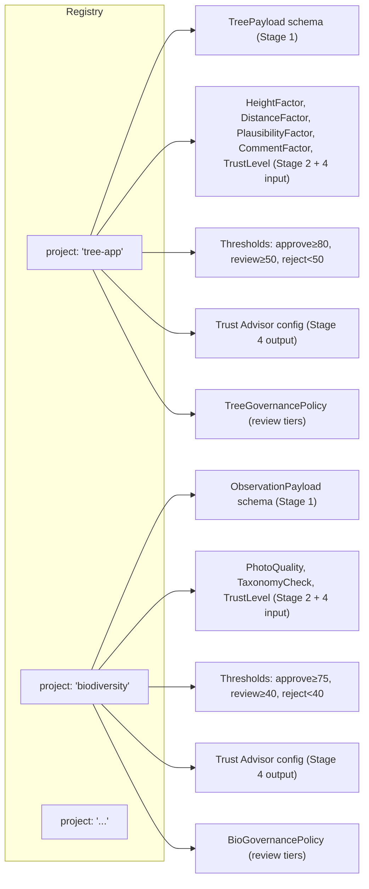
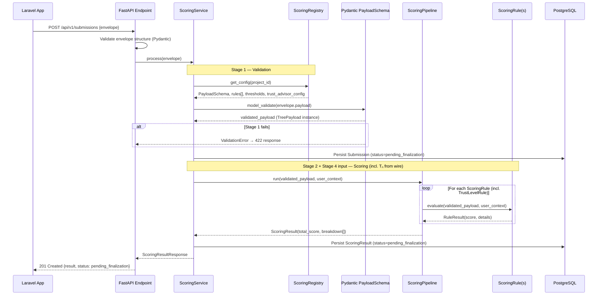
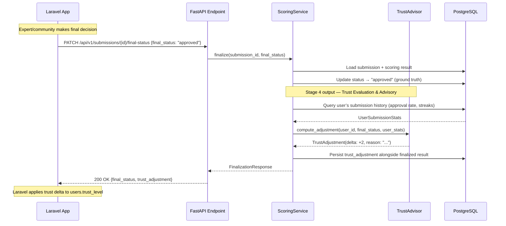
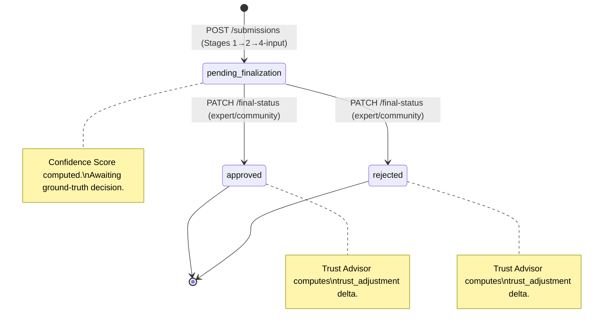
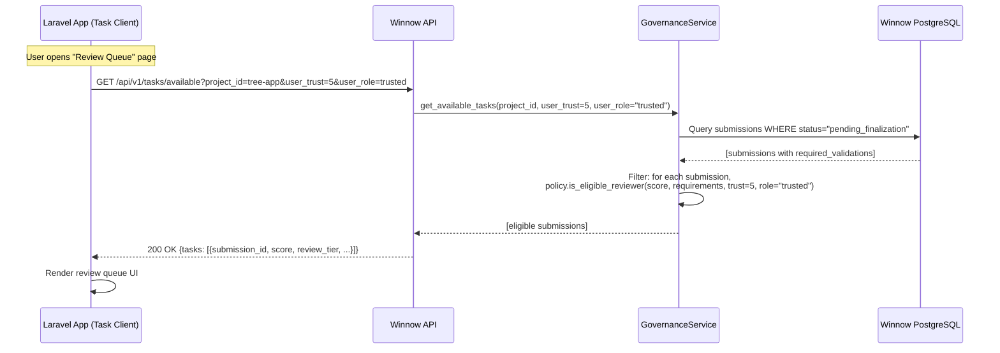
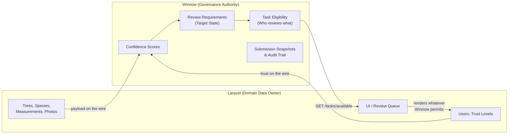
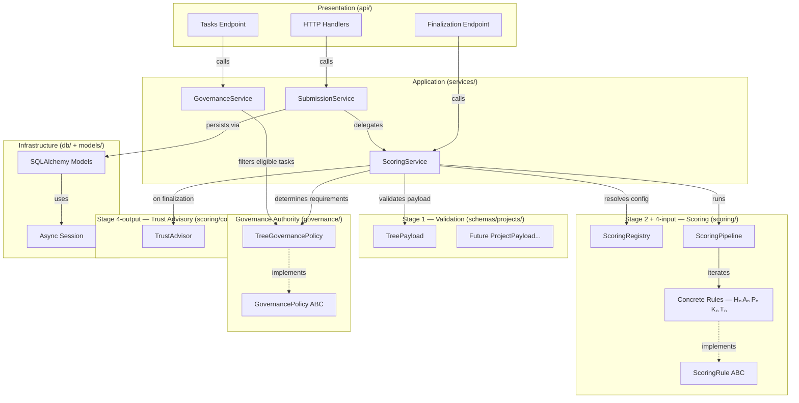

# 02 — Architecture Patterns

> Design patterns that make Winnow's scoring logic dynamic, extensible, and project-agnostic.

**Terminology reminder:** *"Validation"* = Stage 1 (Pydantic schema checks). *"Scoring"* = Stage 2 (Confidence Score factors). *"Trust Evaluation & Advisory"* = Stage 4 — dual role: (a) Tₙ as scoring input from the wire, (b) `trust_adjustment` recommendation computed after ground-truth finalization. See `01_project_structure.md` for the full convention.

---

## Overview of Applied Patterns

| Pattern | Where | Why |
|---|---|---|
| **Strategy Pattern** | `app/scoring/` | Swap scoring rules per project without changing the pipeline. |
| **Envelope Pattern** | `app/schemas/envelope.py` | Separate stable metadata from variable domain payloads. |
| **Registry Pattern** | `app/scoring/registry.py` | Dynamically resolve which Pydantic schema (Stage 1), scoring strategies (Stage 2 + 4), and governance policy apply to a given `project_id`. |
| **Trust Advisor Pattern** | `app/scoring/common/trust_advisor.py` | Winnow advises, the client decides. Computes per-submission `trust_adjustment` deltas based on ground-truth finalization signals. |
| **Task Orchestration Pattern** | `app/governance/` + `app/services/governance_service.py` | Winnow is the **Governance Authority**: it determines review requirements (Target State) per submission and controls which tasks are available to which reviewers. Client projects act as Task Clients. |
| **Repository Pattern** | `app/services/` + `app/models/` | Abstract database access behind service functions so domain logic stays DB-free. |
| **Dependency Injection** | FastAPI `Depends` | Wire sessions, configs, and registries into handlers at runtime. |

---

## 1. Strategy Pattern — Dynamic Scoring Rules

The **Strategy Pattern** is the architectural backbone of Winnow. Each scoring factor is encapsulated as a self-contained *strategy* that conforms to a common interface. The `ScoringPipeline` does not know which rules it runs — it simply iterates over whatever strategies the registry provides for the current project.

### Class Diagram



> **Note:** `RangeCheckRule` and `CompletenessRule` are deliberately **absent** from this diagram. Those concerns are handled entirely by Pydantic `Field` constraints in `app/schemas/projects/` (Stage 1). Scoring rules only receive data that has already passed Stage 1.
>
> The **Trust Advisor** (Stage 4 output) is also absent here — it is not a `ScoringRule`. It runs *after* finalization, not during the scoring pipeline. See [Section 6](#6-trust-advisor-pattern--finalization-loop) below.

### How It Works

1. Every scoring rule implements `evaluate(payload, context) → RuleResult`.
2. The `payload` parameter is a **validated Pydantic model instance** (e.g., `TreePayload`), not a raw dict. This is guaranteed because Stage 1 validation runs first.
3. `RuleResult` contains a normalised `score ∈ [0, 1]` and an optional human-readable `details` string.
4. The `ScoringPipeline` collects all `RuleResult` objects, multiplies each by its `weight`, sums them, and produces the final **Confidence Score (CS)**.

### Adding a New Rule

To add a scoring rule for a new project (e.g., a biodiversity observation app):

1. Create `app/scoring/projects/biodiversity/observation_plausibility.py`.
2. Implement `ScoringRule.evaluate(...)`.
3. Register it in the project's rule set inside the registry.

**No existing code needs to change.** This is the [Open/Closed Principle](https://en.wikipedia.org/wiki/Open%E2%80%93closed_principle) in action.

---

## 2. Envelope Pattern — Dynamic API Payloads

Detailed in [03_api_contracts.md](03_api_contracts.md). In summary:

```text
┌──────────────────────────────────┐
│  SubmissionEnvelope              │
│  ┌────────────────────────────┐  │
│  │ metadata (strictly typed)  │  │  ← project_id, submission_id, timestamp
│  ├────────────────────────────┤  │
│  │ user_context (typed)       │  │  ← user_id, role, trust_level (Data on the wire)
│  ├────────────────────────────┤  │
│  │ payload (dynamic JSON)     │  │  ← domain data; shape depends on project_id
│  └────────────────────────────┘  │
└──────────────────────────────────┘
```

The envelope's `metadata` and `user_context` sections are **always** validated by Pydantic. The `payload` section is accepted as a raw `dict[str, Any]` at the API level, then validated by project-specific Pydantic schemas resolved through the registry (Stage 1).

---

## 3. Registry Pattern — Project-to-Rules Mapping

The registry is a central lookup that, given a `project_id`, returns:

1. The **Pydantic schema class** to validate the raw payload against (Stage 1).
2. The **ordered list of `ScoringRule` instances** (with their configured weights) to run (Stage 2 + Stage 4 input).
3. The **scoring thresholds** (e.g., auto-approve ≥ 80, manual review 50–79, auto-reject < 50).
4. The **Trust Advisor configuration** (reward/penalty rules for Stage 4 output).
5. The **GovernancePolicy** instance (review-tier rules for task orchestration).



### How `scoring_service.py` Uses the Registry

This is the critical orchestration flow that enforces the **Stage 1 → Stage 2 → Governance → Stage 4-input** order:

```python
# Conceptual pseudo-code — NOT implementation

async def process_submission(envelope: SubmissionEnvelope) -> ScoringResultResponse:
    # 1. Resolve project configuration from the registry
    config = registry.get_config(envelope.metadata.project_id)
    #    → config contains: PayloadSchema, rules[], thresholds, trust_advisor_config, governance_policy

    # 2. STAGE 1 — Validate raw payload against project-specific Pydantic schema
    #    This enforces completeness, types, range bounds — all structural checks.
    #    If this fails, a 422 error is raised immediately. No scoring occurs.
    validated_payload = config.payload_schema.model_validate(envelope.payload)

    # 3. Persist submission (status = "pending_finalization")
    submission = await persist_submission(envelope, status="pending_finalization")

    # 4. STAGE 2 + STAGE 4 INPUT — Run scoring pipeline with validated data
    #    The pipeline receives a Pydantic model instance, NOT a raw dict.
    #    TrustLevelRule uses user_context.trust_level from the wire as Tₙ.
    result = config.pipeline.run(
        payload=validated_payload,       # ← already validated (Stage 1 passed)
        context=envelope.user_context,
    )

    # 5. GOVERNANCE — Determine review requirements ("Target State")
    #    The governance policy uses the Confidence Score + project rules
    #    to compute who must review this submission and how many reviewers are needed.
    required_validations = config.governance_policy.determine_requirements(
        confidence_score=result.total_score,
        user_context=envelope.user_context,
    )

    # 6. Persist scoring result + governance metadata (status remains "pending_finalization")
    #    The submission awaits ground-truth finalization from the client.
    await persist_result(submission.id, result, required_validations, status="pending_finalization")
    return build_response(result, required_validations, status="pending_finalization", config.thresholds)


async def finalize_submission(submission_id: UUID, final_status: str) -> FinalizationResponse:
    """Called when the client sends PATCH /submissions/{id}/final-status.
    
    The ground-truth decision (approved/rejected by expert/community)
    triggers the Trust Advisor to compute a trust_adjustment delta.
    """
    # 1. Load submission + scoring result
    submission = await get_submission(submission_id)

    # 2. Persist ground-truth status
    await update_submission_status(submission_id, final_status)  # "approved" or "rejected"

    # 3. STAGE 4 OUTPUT — Trust Advisor computes recommendation
    #    Derives user reliability from Winnow's own submissions table,
    #    then computes a per-submission trust_adjustment delta.
    config = registry.get_config(submission.project_id)
    trust_result = config.trust_advisor.compute_adjustment(
        user_id=submission.user_id,
        final_status=final_status,
        user_history=await get_user_submission_stats(submission.user_id),
    )

    return build_finalization_response(submission_id, final_status, trust_result)
```

> **Key insight:** The scoring pipeline, the governance policy, and the Trust Advisor run at **different times**. The pipeline + governance run synchronously on submission (Stage 2 + Tₙ + governance). The Trust Advisor runs only when the client sends the finalization signal with ground-truth data. This ensures that trust recommendations are based on confirmed outcomes, not preliminary scores.
>
> The `validated_payload` passed to `pipeline.run()` is a typed Pydantic model (e.g., `TreePayload`), not a `dict`. This means scoring rules can access fields with type safety (e.g., `payload.measurement.height`) instead of doing error-prone dict lookups.
>
> The `required_validations` returned by the governance policy tells the client exactly who must review this submission (Target State). This is Winnow acting as the **Governance Authority** — the client (Laravel) renders whatever Winnow permits.

### Configuration Source

The registry can be populated from:

- **Code** (simple dict in `registry.py`) — easiest for the first prototype.
- **Database** (`project_config` table) — allows runtime changes without redeployment.
- **A combination** — code defines available rule classes; DB stores weights and thresholds.

For the Bachelor's thesis prototype, starting with code-based configuration and migrating to DB-backed configuration later is the recommended approach.

---

## 4. Scoring Pipeline — Sequence Diagram (Initial Submission)



## 4b. Finalization & Trust Advisory — Sequence Diagram



---

## 5. Status Lifecycle

Submissions move through a defined lifecycle:



### Confidence Score Thresholds (Advisory)

The Confidence Score is included in the initial response to **help the client decide** how to route the submission (auto-approve, manual review, auto-reject). However, the definitive status is always set by the finalization signal.

| Confidence Score | Suggested Action (for client) |
|---|---|
| **≥ upper threshold** (e.g., 80) | Client may auto-approve without expert review. |
| **≥ lower threshold** (e.g., 50) | Flag for community or expert validation. |
| **< lower threshold** (e.g., 50) | Client may auto-reject; submitter notified. |

Thresholds are **per-project** and stored in the registry/config. This allows each Citizen Science project to tune its own tolerance. **Winnow advises; the client decides.**

---

## 6. Task Orchestration Pattern — Governance Authority

The **Task Orchestration Pattern** positions Winnow as the authoritative **Governance Engine** for the validation workflow. While the client project (Laravel) owns the domain data (trees, species, measurements), **Winnow owns the validation process state**: it decides which submissions need review, by whom, and how many validators are required.

### Design Principles

| Principle | Detail |
|---|---|
| **Winnow is the Governance Authority** | Winnow is the single source of truth for the validation workflow status. It determines review requirements ("Target State") and controls task eligibility. |
| **Client as Task Client** | The client project (Laravel) acts as a Task Client: it renders whatever Winnow permits. It calls `GET /tasks/available?user_trust=X` to discover which submissions the current user may review, and displays them accordingly. |
| **Score-driven governance** | Review requirements are determined by the Confidence Score and project-specific governance rules (e.g., "score > 90% needs 1 peer review; score < 50% needs expert review"). |
| **Project-configurable** | Each project registers its own `GovernancePolicy` with custom review tiers. New projects can define entirely different governance rules. |

### Conceptual Interface

```python
# Conceptual pseudo-code — NOT implementation

class RequiredValidations(BaseModel):
    """The 'Target State' — what must happen before this submission can be finalized."""
    min_validators: int            # e.g., 1, 2, 3
    required_min_trust: int        # minimum trust level for eligible reviewers
    required_role: str | None      # e.g., "expert", None = any role
    review_tier: str               # e.g., "auto_approve", "peer_review", "expert_review"


class GovernancePolicy(ABC):
    """Abstract base for project-specific governance rules."""

    @abstractmethod
    def determine_requirements(
        self,
        confidence_score: float,
        user_context: UserContext,
    ) -> RequiredValidations:
        """Given a scored submission, determine the review requirements."""
        ...

    @abstractmethod
    def is_eligible_reviewer(
        self,
        submission_score: float,
        submission_requirements: RequiredValidations,
        reviewer_trust: int,
        reviewer_role: str,
    ) -> bool:
        """Can a reviewer with the given trust/role review this submission?"""
        ...
```

### Tree-App Governance Example

```python
# Conceptual pseudo-code — NOT implementation

class TreeGovernancePolicy(GovernancePolicy):
    """Governance rules for the tree-tracking project."""

    def determine_requirements(self, confidence_score, user_context):
        if confidence_score >= 90:
            return RequiredValidations(
                min_validators=1, required_min_trust=3,
                required_role=None, review_tier="peer_review"
            )
        elif confidence_score >= 50:
            return RequiredValidations(
                min_validators=2, required_min_trust=5,
                required_role=None, review_tier="community_review"
            )
        else:  # score < 50
            return RequiredValidations(
                min_validators=1, required_min_trust=7,
                required_role="expert", review_tier="expert_review"
            )
```

### Task Query Flow



### Domain Ownership Diagram



---

## 7. Trust Advisor Pattern — Finalization Loop

The **Trust Advisor** is a dedicated component (not a `ScoringRule`) that encapsulates the reward/penalty logic for Stage 4 output. It is invoked only when the client sends a finalization signal with a ground-truth decision.

### Design Principles

| Principle | Detail |
|---|---|
| **Winnow advises, client decides** | The Trust Advisor returns a `trust_adjustment` recommendation. The client (Laravel) is free to apply, modify, or ignore it. |
| **Ground-truth only** | Recommendations are computed from finalized outcomes (expert/community verdicts), never from preliminary scores. |
| **No user table in Winnow** | The Advisor derives user reliability metrics (approval rate, streak length, total finalized submissions) from Winnow's own `submissions` table. No synchronized `users` table is needed. |
| **Configurable per project** | Reward/penalty rules (e.g., "+2 for 5 consecutive approvals", "−3 for a rejection") are part of the project's registry configuration. |

### Conceptual Interface

```python
# Conceptual pseudo-code — NOT implementation

class TrustAdvisor:
    """Computes trust_adjustment deltas based on ground-truth finalization."""

    def __init__(self, config: TrustAdvisorConfig):
        self.reward_per_approval = config.reward_per_approval    # e.g., +1
        self.penalty_per_rejection = config.penalty_per_rejection # e.g., -3
        self.streak_bonus = config.streak_bonus                   # e.g., +2 for 5 consecutive approvals
        self.max_trust = config.max_trust                         # e.g., 10
        self.min_trust = config.min_trust                         # e.g., 0

    def compute_adjustment(
        self,
        user_id: UUID,
        final_status: str,               # "approved" or "rejected"
        user_history: UserSubmissionStats, # derived from Winnow's submissions table
    ) -> TrustAdjustment:
        # Apply reward/penalty based on the finalization outcome
        # Consider streaks, approval rate, total submissions
        # Clamp recommended new level to [min_trust, max_trust]
        ...
```

### Data Flow

```text
Laravel                          Winnow
  │                                │
  │  POST /submissions {envelope}  │
  │ ─────────────────────────────► │  → Stage 1 → Stage 2 → Tₙ input
  │  ◄───────────────────────────  │  ← 201 {score, status: pending_finalization}
  │                                │
  │  (expert reviews data)         │
  │                                │
  │  PATCH /submissions/{id}/      │
  │    final-status {approved}     │
  │ ─────────────────────────────► │  → Stage 4 output: Trust Advisor
  │  ◄───────────────────────────  │  ← 200 {trust_adjustment: {delta: +2, reason: "..."}}
  │                                │
  │  applies delta to              │
  │  users.trust_level             │
```

---

## 8. Separation of Concerns Summary



> **The golden rule:** Domain logic (`scoring/`, `governance/`) never imports from infrastructure (`db/`, `models/`) or presentation (`api/`). It receives validated data and returns plain results. The Trust Advisor receives pre-computed user stats (derived by the service layer from the submissions table) — it does not query the database itself. The Governance Policy receives scoring results and returns review requirements — it does not query the database itself.
