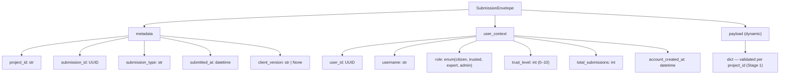
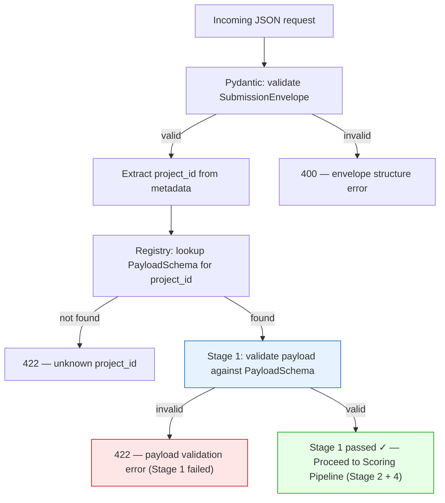
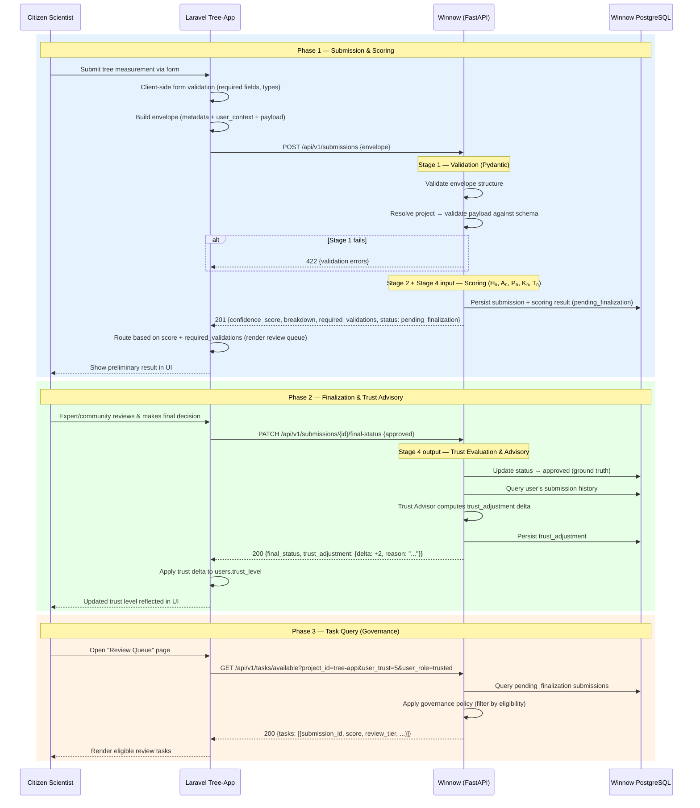

# 03 — API Contracts

> JSON payload design for communication between client systems (e.g., Laravel tree-app) and the Winnow FastAPI microservice.

**Terminology reminder:** *"Validation"* = Stage 1 (Pydantic schema checks). *"Scoring"* = Stage 2 (Confidence Score factors). *"Trust Evaluation & Advisory"* = Stage 4 — dual role: (a) Tₙ as scoring input, (b) `trust_adjustment` recommendation after ground-truth finalization. See `01_project_structure.md` for the full convention.

---

## Design Principles

1. **Envelope Pattern** — Every request wraps domain data inside a stable, strictly-typed outer structure.
2. **Data on the Wire** — User metadata (role, trust level) travels with every request because databases are separated (Database-per-Service).
3. **Dynamic Payload** — The inner `payload` varies per project; it is accepted as raw JSON, then validated server-side against the project-specific Pydantic schema (Stage 1).
4. **Stage 1 as Prerequisite** — The raw payload **must** pass Stage 1 validation (Pydantic schema — types, ranges, completeness) before any scoring (Stage 2 + Stage 4 input) is attempted. A failed Stage 1 results in an immediate `422` error response with no scoring.
5. **Winnow Advises, Client Decides** — Winnow returns a Confidence Score and scoring breakdown. After expert/community finalization, it returns a `trust_adjustment` recommendation. The client (Laravel) owns the trust level and decides whether to apply it.
6. **Immutable Submission Snapshots** — Winnow stores submissions as point-in-time snapshots. Data corrections in the client trigger a new submission, not an update to the old one.
7. **RFC 7807 Problem Details** — All error responses follow a standardised structure.
8. **Winnow as Governance Authority** — Winnow owns the validation workflow state. It determines review requirements ("Target State") for each submission and controls which submissions are eligible for review by which users. The client (Laravel) acts as a **Task Client** — it renders whatever Winnow permits. See `02_architecture_patterns.md` §6 for the full Task Orchestration Pattern.
9. **Domain Ownership Separation** — Laravel owns domain data (trees, species, measurements) and user identity. Winnow owns the validation process state (submission lifecycle, review requirements, scoring results, audit trail). Neither system accesses the other's database.

---

## 1. Submission Request — Envelope Structure

### Endpoint

```
POST /api/v1/submissions
Content-Type: application/json
```

### Full JSON Example (Tree Measurement)

```json
{
  "metadata": {
    "project_id": "tree-app",
    "submission_id": "a1b2c3d4-e5f6-7890-abcd-ef1234567890",
    "submission_type": "tree_measurement",
    "submitted_at": "2026-03-10T17:30:00Z",
    "client_version": "1.2.0"
  },
  "user_context": {
    "user_id": "f47ac10b-58cc-4372-a567-0e02b2c3d479",
    "username": "maria_oak",
    "role": "citizen",
    "trust_level": 3,
    "total_submissions": 42,
    "account_created_at": "2025-01-15T10:00:00Z"
  },
  "payload": {
    "tree": {
      "tree_id": "b8f9e0d1-2a3b-4c5d-6e7f-8a9b0c1d2e3f",
      "species_id": "c1d2e3f4-5a6b-7c8d-9e0f-1a2b3c4d5e6f",
      "species_name": "Quercus robur",
      "condition": "healthy",
      "location": {
        "latitude": 50.5558,
        "longitude": 9.6808
      },
      "location_confidence": "measured"
    },
    "measurement": {
      "height": 18.5,
      "trunk_diameter": 45,
      "inclination": 5,
      "distance_to_tree": 20.0,
      "distance_measured": true,
      "note": null
    },
    "photos": [
      {
        "photo_id": "d4e5f6a7-b8c9-0d1e-2f3a-4b5c6d7e8f90",
        "type": "side_view",
        "url": "https://tree-app.example.com/photos/abc123.jpg"
      },
      {
        "photo_id": "e5f6a7b8-c9d0-1e2f-3a4b-5c6d7e8f9a01",
        "type": "angle_45",
        "url": "https://tree-app.example.com/photos/def456.jpg"
      }
    ],
    "species_reference": {
      "a": 0.5,
      "b": 1.2,
      "c": 0.8,
      "d": null,
      "e": null,
      "f": null,
      "g": null
    }
  }
}
```

### Envelope Anatomy



---

## 2. Pydantic Schema Design (Conceptual)

> These are **design sketches**, not implementation code. They show the intended structure.

### Envelope (stable across all projects)

```python
# app/schemas/envelope.py  (conceptual)

class SubmissionMetadata(BaseModel):
    project_id: str                       # e.g. "tree-app"
    submission_id: UUID
    submission_type: str                  # e.g. "tree_measurement", "tree_registration"
    submitted_at: datetime
    client_version: str | None = None

class UserContext(BaseModel):
    user_id: UUID
    username: str
    role: Literal["citizen", "trusted", "expert", "admin"]
    trust_level: int = Field(ge=0, le=10)
    total_submissions: int = Field(ge=0)
    account_created_at: datetime

class SubmissionEnvelope(BaseModel):
    metadata: SubmissionMetadata
    user_context: UserContext
    payload: dict[str, Any]               # Validated later by project-specific schema (Stage 1)
```

### Tree Project Payload — Stage 1 Validation Schema

> These Pydantic models in `app/schemas/projects/trees.py` enforce **all Stage 1 checks**: required fields (completeness), type correctness, and range constraints. Any submission that fails these checks is immediately rejected with a `422` error — the scoring pipeline is never invoked.

```python
# app/schemas/projects/trees.py  (conceptual)

class TreeLocation(BaseModel):
    latitude: float = Field(ge=-90, le=90)
    longitude: float = Field(ge=-180, le=180)

class TreeInfo(BaseModel):
    tree_id: UUID | None = None           # None when registering a new tree
    species_id: UUID
    species_name: str | None = None
    condition: Literal["healthy", "damaged", "diseased", "dead"]
    location: TreeLocation
    location_confidence: Literal["measured", "estimated", "unknown"]

class TreeMeasurement(BaseModel):
    height: float = Field(gt=0, le=150)   # metres; 150 as absolute sanity cap
    trunk_diameter: int = Field(gt=0)     # mm
    inclination: int = Field(ge=0, le=90) # degrees
    distance_to_tree: float = Field(gt=0) # metres
    distance_measured: bool               # True = measured step length, False = estimated
    note: str | None = None

class TreePhoto(BaseModel):
    photo_id: UUID
    type: Literal["side_view", "angle_45"]
    url: HttpUrl

class SpeciesReference(BaseModel):
    """Allometric coefficients from the tree_species table (a–g)."""
    a: float | None = None
    b: float | None = None
    c: float | None = None
    d: float | None = None
    e: float | None = None
    f: float | None = None
    g: float | None = None

class TreePayload(BaseModel):
    tree: TreeInfo
    measurement: TreeMeasurement
    photos: list[TreePhoto] = Field(min_length=2)
    species_reference: SpeciesReference | None = None
```

### Stage 1 → Stage 2 Validation Flow



> **Stage 1 is the gatekeeper:** If the payload fails Pydantic validation (missing required fields, out-of-range values, wrong types), the request is rejected immediately. The scoring pipeline **never** receives invalid data.

---

## 3. Scoring Response (Initial Submission)

### Endpoint

```
← 201 Created
Content-Type: application/json
```

### JSON Example

```json
{
  "submission_id": "a1b2c3d4-e5f6-7890-abcd-ef1234567890",
  "project_id": "tree-app",
  "status": "pending_finalization",
  "confidence_score": 67.5,
  "breakdown": [
    {
      "rule": "height_factor",
      "weight": 0.20,
      "score": 0.85,
      "weighted_score": 17.0,
      "details": "Height 18.5m normalised against h_max=72m"
    },
    {
      "rule": "distance_factor",
      "weight": 0.20,
      "score": 1.00,
      "weighted_score": 20.0,
      "details": "Distance was measured (not estimated)"
    },
    {
      "rule": "trust_level",
      "weight": 0.25,
      "score": 0.30,
      "weighted_score": 7.5,
      "details": "Trust level 3/10 (Stage 4 input: from wire)"
    },
    {
      "rule": "comment_factor",
      "weight": 0.05,
      "score": 1.00,
      "weighted_score": 5.0,
      "details": "No comment present — no penalty"
    },
    {
      "rule": "plausibility_factor",
      "weight": 0.30,
      "score": 0.60,
      "weighted_score": 18.0,
      "details": "Height deviates ~1.2σ from species average"
    }
  ],
  "required_validations": {
    "min_validators": 2,
    "required_min_trust": 5,
    "required_role": null,
    "review_tier": "community_review"
  },
  "thresholds": {
    "approve": 80,
    "review": 50,
    "reject": 50
  },
  "created_at": "2026-03-10T17:30:01Z"
}
```

> **Note:** The initial response always returns `status: "pending_finalization"`. The Confidence Score, thresholds, and `required_validations` are provided so the client has **immediate metadata for its UI**. The `required_validations` object defines the "Target State" — how many validators are needed, what minimum trust level they require, and whether a specific role (e.g., expert) is mandatory. The client renders its review queue and permissions accordingly. The definitive status is set by the finalization signal.

### Response Schema (Conceptual)

```python
# app/schemas/results.py  (conceptual)

class RuleBreakdown(BaseModel):
    rule: str
    weight: float
    score: float            # normalised 0–1
    weighted_score: float   # score × weight × 100
    details: str | None

class ThresholdConfig(BaseModel):
    approve: float
    review: float
    reject: float

class RequiredValidations(BaseModel):
    min_validators: int          # e.g., 1, 2, 3
    required_min_trust: int      # minimum trust level for eligible reviewers
    required_role: str | None    # e.g., "expert", None = any role
    review_tier: str             # e.g., "peer_review", "community_review", "expert_review"

class ScoringResultResponse(BaseModel):
    submission_id: UUID
    project_id: str
    status: Literal["pending_finalization", "approved", "rejected"]
    confidence_score: float  # 0–100
    breakdown: list[RuleBreakdown]
    required_validations: RequiredValidations
    thresholds: ThresholdConfig
    created_at: datetime
```

---

## 3b. Finalization Request & Response

After the client’s expert or community makes a final decision, the client notifies Winnow. This closes the feedback loop and triggers the Trust Advisor (Stage 4 output).

### Endpoint

```
PATCH /api/v1/submissions/{submission_id}/final-status
Content-Type: application/json
```

### Request Body

```json
{
  "final_status": "approved",
  "reviewed_by": "expert_user_42",
  "review_note": "Measurement confirmed on-site."
}
```

### Request Schema (Conceptual)

```python
# app/schemas/finalization.py  (conceptual)

class FinalizationRequest(BaseModel):
    final_status: Literal["approved", "rejected"]
    reviewed_by: str | None = None       # who made the decision
    review_note: str | None = None       # optional explanation
```

### Response (200 OK)

```json
{
  "submission_id": "a1b2c3d4-e5f6-7890-abcd-ef1234567890",
  "final_status": "approved",
  "confidence_score": 67.5,
  "trust_adjustment": {
    "user_id": "f47ac10b-58cc-4372-a567-0e02b2c3d479",
    "recommended_delta": 2,
    "reason": "5 consecutive approved submissions (streak bonus)",
    "current_trust_level": 3
  },
  "finalized_at": "2026-03-11T09:15:00Z"
}
```

### Response Schema (Conceptual)

```python
# app/schemas/finalization.py  (conceptual)

class TrustAdjustment(BaseModel):
    user_id: UUID
    recommended_delta: int               # positive = reward, negative = penalty
    reason: str
    current_trust_level: int             # as received on the wire at submission time

class FinalizationResponse(BaseModel):
    submission_id: UUID
    final_status: Literal["approved", "rejected"]
    confidence_score: float              # original score for reference
    trust_adjustment: TrustAdjustment
    finalized_at: datetime
```

> **Important:** The `trust_adjustment` is a **recommendation**. Laravel receives it and decides whether to apply it to `users.trust_level`. Winnow never directly modifies the client’s user data.


> **Race-condition safeguard:** The `TrustAdjustment` response deliberately omits a `recommended_new_level` field. Returning a pre-computed new level would tempt the client to blindly overwrite its DB value, causing race conditions when parallel submissions produce concurrent deltas. The client **MUST** apply only the `recommended_delta` atomically (e.g., `UPDATE users SET trust_level = CLAMP(trust_level + delta, 0, 10) WHERE id = ?`).

---

## 4. Error Responses — RFC 7807 Problem Details

All error responses use a consistent structure based on [RFC 7807](https://www.rfc-editor.org/rfc/rfc7807).

### Schema

```json
{
  "type": "https://winnow.example.com/errors/validation-error",
  "title": "Payload Validation Failed",
  "status": 422,
  "detail": "Stage 1 validation failed: 2 errors in tree measurement payload.",
  "instance": "/api/v1/submissions",
  "errors": [
    {
      "field": "payload.measurement.height",
      "message": "Value must be greater than 0.",
      "type": "value_error"
    },
    {
      "field": "payload.photos",
      "message": "At least 2 photos are required.",
      "type": "value_error"
    }
  ]
}
```

### Error Types

| HTTP Status | `type` suffix | When |
|---|---|---|
| `400` | `/errors/bad-request` | Malformed JSON, missing required envelope fields. |
| `404` | `/errors/not-found` | Submission ID not found when querying results. |
| `422` | `/errors/validation-error` | Stage 1 Pydantic validation failure on envelope or payload. |
| `422` | `/errors/unknown-project` | `project_id` not registered in the system. |
| `409` | `/errors/already-finalized` | Submission already finalized with a different status (conflict). |
| `500` | `/errors/internal` | Unexpected server error. |

---

## 5. Data Flow — Full Lifecycle (Laravel ↔ Winnow)



---

## 6. Task Query — Available Review Tasks (Governance)

This endpoint enables the client to ask Winnow: *"Which submissions are currently eligible for review by a user with Trust Level X?"*

Winnow filters its `submissions` table using the project's governance policy (registered in the registry). The client acts as a **Task Client** — it renders whatever Winnow permits.

### Endpoint

```
GET /api/v1/tasks/available?project_id=tree-app&user_trust=5&user_role=trusted
```

### Query Parameters

| Parameter | Type | Required | Description |
|---|---|---|---|
| `project_id` | string | Yes | Which project's submissions to query. |
| `user_trust` | int (0–10) | Yes | The reviewer's current trust level (sent by the client). |
| `user_role` | string | No | The reviewer's role (e.g., `citizen`, `trusted`, `expert`). Defaults to `citizen`. |
| `page` | int | No | Page number for pagination (default: 1). |
| `per_page` | int | No | Items per page (default: 20, max: 100). |

### Response (200 OK)

```json
{
  "tasks": [
    {
      "submission_id": "a1b2c3d4-e5f6-7890-abcd-ef1234567890",
      "project_id": "tree-app",
      "submission_type": "tree_measurement",
      "confidence_score": 67.5,
      "review_tier": "community_review",
      "required_validations": {
        "min_validators": 2,
        "required_min_trust": 5,
        "required_role": null,
        "review_tier": "community_review"
      },
      "submitted_at": "2026-03-10T17:30:01Z"
    },
    {
      "submission_id": "b2c3d4e5-f6a7-8901-bcde-f12345678901",
      "project_id": "tree-app",
      "submission_type": "tree_measurement",
      "confidence_score": 42.0,
      "review_tier": "expert_review",
      "required_validations": {
        "min_validators": 1,
        "required_min_trust": 7,
        "required_role": "expert",
        "review_tier": "expert_review"
      },
      "submitted_at": "2026-03-10T18:00:00Z"
    }
  ],
  "total": 2,
  "page": 1,
  "per_page": 20
}
```

> **Note:** The second task (`expert_review`) would only appear for a reviewer with `user_trust ≥ 7` AND `user_role = expert`. Winnow applies the governance policy's `is_eligible_reviewer()` logic server-side to filter results. The client never needs to implement this logic.

### Response Schema (Conceptual)

```python
# app/schemas/tasks.py  (conceptual)

class TaskItem(BaseModel):
    submission_id: UUID
    project_id: str
    submission_type: str
    confidence_score: float
    review_tier: str
    required_validations: RequiredValidations
    submitted_at: datetime

class TaskListResponse(BaseModel):
    tasks: list[TaskItem]
    total: int
    page: int
    per_page: int
```

---

## 7. Querying Results

### Endpoint

```
GET /api/v1/results/{submission_id}
```

### Response

Returns the `ScoringResultResponse` schema (including `required_validations`). If the submission has been finalized, the response also includes the `trust_adjustment` data.

### List Endpoint (optional, for dashboards)

```
GET /api/v1/results?project_id=tree-app&status=pending_finalization&page=1&per_page=20
```

---

## 8. Questions & Assumptions

> These are documented here for discussion; they do not block the initial prototype.

1. **Authentication between Laravel and Winnow:** Assumed to use a shared API key (`X-API-Key` header) for the prototype. A more robust solution (e.g., mutual TLS, OAuth2 client credentials) can be added later.

2. **Photo handling:** Winnow does **not** receive raw image files. The Laravel app uploads photos to its own storage; only URLs are passed in the payload. Future ML-based image validation could fetch images on demand.

3. **Submission types:** The `submission_type` field (e.g., `tree_measurement` vs. `tree_registration`) allows different validation rule sets within the same project. For the tree-app prototype, `tree_measurement` is the primary type.

4. **Species reference data:** The allometric coefficients (`a`–`g`) from `tree_species` are sent in the payload so Winnow can compute plausibility without accessing the Laravel database. If this data rarely changes, a caching mechanism on Winnow's side could be considered.

5. **Idempotency:** The `submission_id` is generated by the client (Laravel). If a submission with the same ID is sent twice, Winnow should return the existing result rather than re-processing (idempotent POST). The finalization endpoint is also idempotent — re-sending the same `final_status` returns the existing result.

6. **Synchronous flow (Phase 1):** The current design is synchronous (request → response) for both submission and finalization. If scoring becomes slow (e.g., ML inference), a future Phase 2 iteration could accept the submission with `202 Accepted` and POST results back to a Laravel webhook.

7. **Trust Advisor as recommendation:** The `trust_adjustment` returned in the finalization response is advisory. Laravel owns the `trust_level` field and has the final say on whether to apply the delta. This avoids dual-write consistency issues.

8. **Data corrections:** If the original data in Laravel is corrected after submission, the client should send a **new submission** to Winnow with the corrected data. The old submission and its score remain as an immutable historical record. Winnow stores submissions, not entities.
