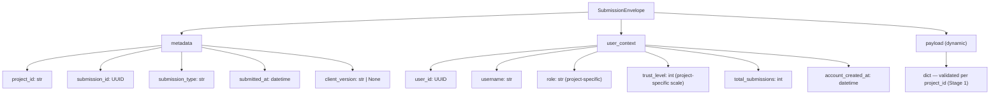
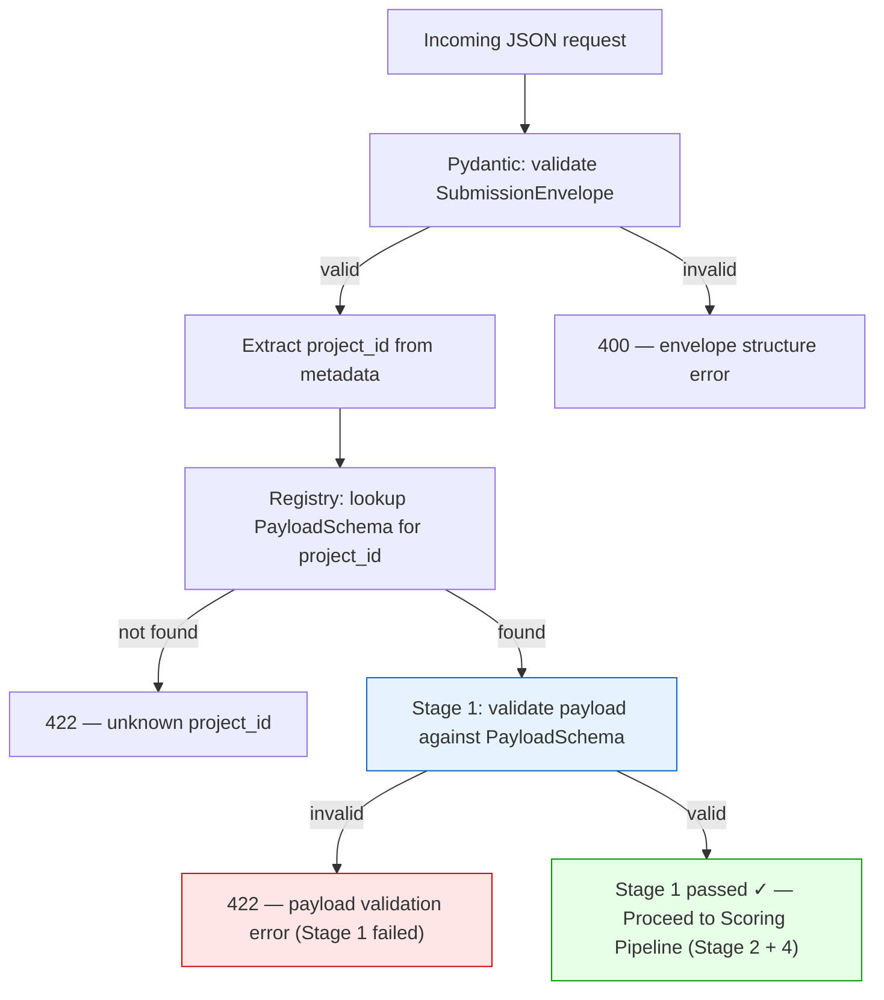
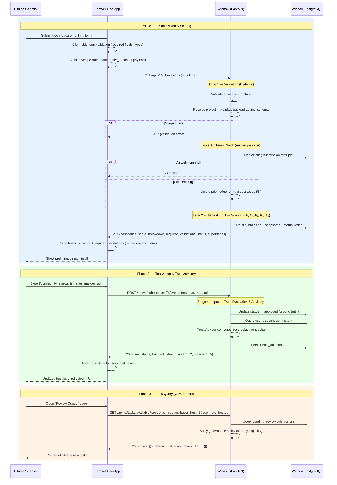
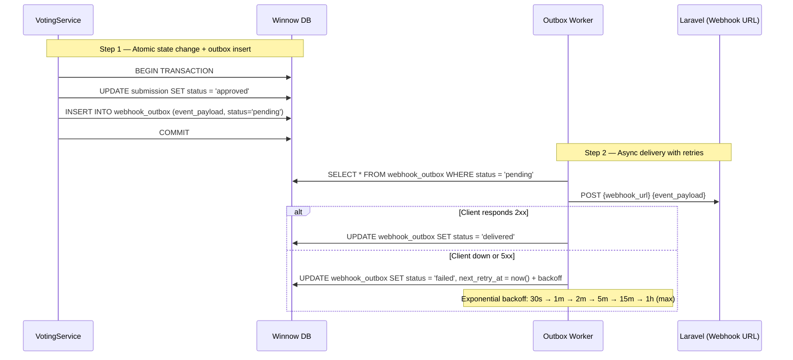
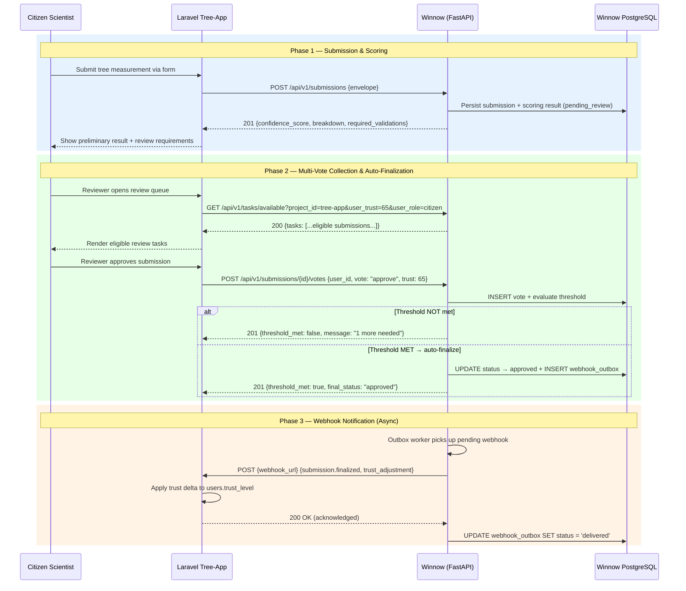

# 03 — API Contracts

> JSON payload design for communication between client systems (e.g., Laravel tree-app) and the Winnow FastAPI microservice.

**Terminology reminder:** *"Validation"* = Stage 1 (Pydantic schema checks). *"Scoring"* = Stage 2 (Confidence Score factors). *"Trust Evaluation & Advisory"* = Stage 4 — dual role: (a) Tₙ as scoring input, (b) `trust_adjustment` recommendation after ground-truth finalization. See `01_project_structure.md` for the full convention.

---

## Design Principles

1. **Envelope Pattern** — Every request wraps domain data inside a stable, strictly-typed outer structure.
2. **Data on the Wire** — User metadata (role, trust level) travels with every request because databases are separated (Database-per-Service).
3. **Dynamic Payload** — The inner `payload` varies per project; it is accepted as raw JSON, then validated server-side against the project-specific Pydantic schema (Stage 1).
4. **Stage 1 as Prerequisite** — The raw payload **must** pass Stage 1 validation (Pydantic schema — types, ranges, completeness) before any scoring (Stage 2 + Stage 4 input) is attempted. A failed Stage 1 results in an immediate `422` error response with no scoring.
5. **Winnow Advises, Client Decides** — Winnow returns a Confidence Score and scoring breakdown. After expert/community finalization, it returns a `trust_adjustment` recommendation. The client (Laravel) owns the trust level and decides whether to apply it.
6. **Immutable Submission Snapshots** — Winnow stores submissions as point-in-time snapshots. Data corrections in the client trigger a new submission, not an update to the old one.
7. **RFC 7807 Problem Details** — All error responses follow a standardised structure.
8. **Winnow as Governance Authority** — Winnow owns the validation workflow state. It determines review requirements ("Target State") for each submission and controls which submissions are eligible for review by which users. The client (Laravel) acts as a **Task Client** — it renders whatever Winnow permits. See `02_architecture_patterns.md` §6 for the full Task Orchestration Pattern.
9. **Domain Ownership Separation** — Laravel owns domain data (trees, species, measurements) and user identity. Winnow owns the validation process state (submission lifecycle, review requirements, scoring results, audit trail). Neither system accesses the other's database.

---

## 1. Submission Request — Envelope Structure

### Endpoint

```
POST /api/v1/submissions
Content-Type: application/json
```

### Full JSON Example (Tree Measurement)

```json
{
  "metadata": {
    "project_id": "tree-app",
    "submission_id": "a1b2c3d4-e5f6-7890-abcd-ef1234567890",
    "submission_type": "tree",
    "submitted_at": "2026-03-10T17:30:00Z",
    "client_version": "1.2.0"
  },
  "user_context": {
    "user_id": "f47ac10b-58cc-4372-a567-0e02b2c3d479",
    "username": "maria_oak",
    "role": "citizen",
    "trust_level": 3,
    "total_submissions": 42,
    "account_created_at": "2025-01-15T10:00:00Z"
  },
  "payload": {
    "tree_id": "b8f9e0d1-2a3b-4c5d-6e7f-8a9b0c1d2e3f",
    "species_id": "c1d2e3f4-5a6b-7c8d-9e0f-1a2b3c4d5e6f",
    "measurement": {
      "height": 18.5,
      "trunk_diameter": 45,
      "inclination": 5,
      "note": null
    },
    "step_length_measured": true,
    "photos": [
      {
        "path": "photos/abc123.jpg",
        "note": null
      },
      {
        "path": "photos/def456.jpg",
        "note": null
      }
    ],
    "species_stats": {
      "mean_height": 20.0,
      "std_height": 5.0,
      "mean_inclination": 3.0,
      "std_inclination": 2.0,
      "mean_trunk_diameter": 50.0,
      "std_trunk_diameter": 10.0
    }
  }
}
```

### Envelope Anatomy



---

## 2. Pydantic Schema Design (Conceptual)

> These are **design sketches**, not implementation code. They show the intended structure.

### Envelope (stable across all projects)

```python
# app/schemas/envelope.py  (conceptual)

class SubmissionMetadata(BaseModel):
    project_id: str                       # e.g. "tree-app"
    submission_id: UUID
    submission_type: str                  # e.g. "tree", "shrub"
    submitted_at: AwareDatetime           # timezone-aware ISO-8601 timestamp (required)
    client_version: str | None = None

class UserContext(BaseModel):
    user_id: UUID
    username: str
    role: str = Field(min_length=1)      # project-specific roles
    trust_level: int = Field(ge=0)        # scale is project-specific
    total_submissions: int = Field(ge=0)
    account_created_at: AwareDatetime     # timezone-aware ISO-8601 timestamp (required)

class SubmissionEnvelope(BaseModel):
    metadata: SubmissionMetadata
    user_context: UserContext
    payload: dict[str, Any]               # Validated later by project-specific schema (Stage 1)
```

### Tree Project Payload — Stage 1 Validation Schema

> These Pydantic models in `app/schemas/projects/trees.py` enforce **all Stage 1 checks**: required fields (completeness), type correctness, and range constraints. Any submission that fails these checks is immediately rejected with a `422` error — the scoring pipeline is never invoked.

```python
# app/schemas/projects/trees.py  (conceptual)

class TreePhotoPayload(BaseModel):
    path: str = Field(min_length=1)       # relative or absolute path/URL to stored photo
    note: str | None = None               # optional free-text note for this photo

class TreeMeasurementPayload(BaseModel):
    height: float = Field(gt=0)           # metres (must be positive; no upper cap — governed by scoring)
    trunk_diameter: int = Field(gt=0)     # centimetres (DBH)
    inclination: int = Field(ge=0, le=90) # degrees from vertical
    note: str | None = None

class SpeciesStats(BaseModel):
    """Historical species statistics forwarded by the client for Pₙ scoring.
    Winnow is stateless w.r.t. species data — Laravel supplies μ/σ per submission."""
    mean_height: float = Field(gt=0)
    std_height: float = Field(ge=0)
    mean_inclination: float = Field(ge=0, le=90)
    std_inclination: float = Field(ge=0)
    mean_trunk_diameter: float = Field(gt=0)
    std_trunk_diameter: float = Field(ge=0)

class TreePayload(BaseModel):
    tree_id: UUID
    species_id: UUID
    measurement: TreeMeasurementPayload
    photos: list[TreePhotoPayload] = Field(min_length=2)  # ≥ 2 photos required
    step_length_measured: bool          # True = physically measured; False = estimated (Aₙ input)
    species_stats: SpeciesStats         # mandatory — required for Pₙ plausibility scoring

    @model_validator(mode="after")
    def photos_have_unique_paths(self) -> "TreePayload":
        """Guard: no duplicate photo paths within one submission."""
        ...
```

> **Key design notes vs. earlier drafts:**
> - The payload is **flat** — `tree_id` and `species_id` sit directly on `TreePayload`, not inside a nested `TreeInfo` sub-object. Fields like `condition`, `location`, and `location_confidence` belong to Laravel's domain data and are not forwarded to Winnow.
> - `trunk_diameter` is in **centimetres** (not mm).
> - The distance field is `step_length_measured: bool` (was it physically measured?), not a separate `distance_to_tree` float — Winnow only needs the boolean for the Aₙ factor.
> - Photos carry a `path` string and an optional `note`; there is no `photo_id`, `type`, or `url` field — photo identity and classification are Laravel's concern.
> - `species_stats` (μ/σ values for height, inclination, and trunk diameter) replaces the old allometric `species_reference` (a–g coefficients). It is **required** — every submission must include species statistics for Pₙ plausibility scoring.

### Stage 1 → Stage 2 Validation Flow



> **Stage 1 is the gatekeeper:** If the payload fails Pydantic validation (missing required fields, out-of-range values, wrong types), the request is rejected immediately. The scoring pipeline **never** receives invalid data.

---

## 3. Scoring Response (Initial Submission)

### Endpoint

```
← 201 Created
Content-Type: application/json
```

### JSON Example

```json
{
  "submission_id": "a1b2c3d4-e5f6-7890-abcd-ef1234567890",
  "project_id": "tree-app",
  "entity_type": "tree",
  "entity_id": "b8f9e0d1-2a3b-4c5d-6e7f-8a9b0c1d2e3f",
  "measurement_id": "c1d2e3f4-5a6b-7c8d-9e0f-1a2b3c4d5e6f",
  "ledger_entry_id": "f47ac10b-58cc-4372-a567-0e02b2c3d479",
  "status": "pending_review",
  "confidence_score": 67.5,
  "breakdown": [
    {
      "rule": "height_factor",
      "weight": 0.20,
      "score": 0.85,
      "weighted_score": 17.0,
      "details": "Height 18.5m normalised against h_max=72m"
    },
    {
      "rule": "distance_factor",
      "weight": 0.20,
      "score": 1.00,
      "weighted_score": 20.0,
      "details": "Distance was measured (not estimated)"
    },
    {
      "rule": "trust_level",
      "weight": 0.25,
      "score": 0.30,
      "weighted_score": 7.5,
      "details": "Trust level 3/10 (Stage 4 input: from wire)"
    }
  ],
  "required_validations": [
    {
      "threshold_score": 2,
      "role_configs": {
        "citizen": {"weight": 1, "min_trust": 0},
        "expert": {"weight": 2, "min_trust": 0}
      },
      "default_config": {"weight": 1, "min_trust": 50},
      "blocked_roles": ["guest"],
      "review_tier": "community_review"
    }
  ],
  "thresholds": {
    "auto_approve_min": 80,
    "manual_review_min": 50
  },
  "votes": [],
  "created_at": "2026-03-10T17:30:01Z"
}
```

> **Note:** The initial response returns `status: "pending_review"` (or auto-finalized `approved`/`rejected`). The Confidence Score, thresholds, and `required_validations` are provided so the client has **immediate metadata for its UI**. The `required_validations` list defines the tiers of review needed — how many role-weighted points are needed, and what minimum trust level they require. The client renders its review queue and permissions accordingly.
>
> **Threshold design — 2 boundaries, not 3:** The `thresholds` object intentionally contains only two integer fields. Dividing a 0-100 integer scale into three contiguous routing regions requires exactly 2 boundaries. A third `reject` field would be arithmetically redundant (`reject_max = manual_review_min - 1`) and would open the door to configuration gaps (scores that fall into no region) or overlaps (ambiguous routing). The auto-reject region is **implicit**: any score below `manual_review_min` is auto-rejected by the client without Winnow needing to declare an explicit lower bound. See `02_architecture_patterns.md §5` for the full rationale.

### Response Schema (Conceptual)

```python
# app/schemas/results.py  (conceptual)

class RuleBreakdown(BaseModel):
    rule: str
    weight: float = Field(ge=0.0, le=1.0)   # fractional weight (0–1)
    score: float = Field(ge=0.0, le=1.0)    # normalised rule output (0–1)
    weighted_score: float = Field(ge=0.0)   # score × weight × 100
    details: str | None = None

class ThresholdConfig(BaseModel):
    # 2-boundary integer design: 3 contiguous regions need exactly 2 boundaries.
    # Scores < manual_review_min are implicitly auto-rejected — no third field.
    auto_approve_min: int = Field(ge=0, le=100)   # scores >= this → auto-approve
    manual_review_min: int = Field(ge=0, le=100)  # scores >= this (but < auto_approve_min) → review
    # Cross-field invariant enforced by @model_validator(mode="after"):
    # auto_approve_min >= manual_review_min

class RoleConfig(BaseModel):
    weight: int = Field(ge=0)
    min_trust: int = Field(ge=0)

class RequiredValidations(BaseModel):
    threshold_score: int         # minimum accumulated role-weight to finalise
    role_configs: dict[str, RoleConfig] # role -> weight & min_trust map
    default_config: RoleConfig | None   # fallback for unlisted roles
    blocked_roles: list[str]     # roles explicitly barred from voting
    review_tier: str             # e.g., "community_review"

class ScoringResultResponse(BaseModel):
    submission_id: UUID
    project_id: str
    entity_type: str
    entity_id: UUID
    measurement_id: UUID
    ledger_entry_id: UUID
    status: Literal["pending_review", "approved", "rejected", "voided"]
    supersedes: UUID | None = None
    supersede_reason: str | None = None
    trust_delta: int = 0
    confidence_score: float = Field(ge=0.0, le=100.0)  # 0–100
    breakdown: list[RuleBreakdown]
    required_validations: list[RequiredValidations]
    thresholds: ThresholdConfig
    votes: list[ActiveVoteItem]
    created_at: AwareDatetime             # timezone-aware ISO-8601 timestamp
```

---

## 3b. Automatic Superseding (Triplet Collisions)

Winnow enforces the **Immutable Submissions** principle (Rule 10). When a user corrects their data in the client system, the client sends a brand-new submission. 

If Winnow detects a new submission for the same **(project_id, entity_id, measurement_id)** triplet while a prior submission is still `pending_review`, it **automatically supersedes** the prior one.

- The new submission's first ledger entry carries a `supersedes` pointer to the old submission's latest ledger entry.
- The `supersede_reason` is set to `"edited"`.
- The old submission remains in its last state but is shadowed by the new one in the results lineage.
- If the prior submission is already in a **terminal state** (`approved`, `rejected`, or `voided`), Winnow rejects the new submission with a `409 Conflict` error.

This process ensures that corrections are tracked without mutating existing audit logs, maintaining a single, unbroken chain of truth for every measurement event.

---

> **Important:** Trust adjustments (deltas) are now delivered exclusively via the `trust_delta` field in the webhook payload (Section 10) or by querying the `status_ledger` via the results endpoint. The client (Laravel) receives the delta and applies it atomically to `users.trust_level`.


> **Race-condition safeguard:** The `TrustAdjustment` response deliberately omits a `recommended_new_level` field. Returning a pre-computed new level would tempt the client to blindly overwrite its DB value, causing race conditions when parallel submissions produce concurrent deltas. The client **MUST** apply only the `recommended_delta` atomically, using the returned bounds to clamp the result (e.g., `UPDATE users SET trust_level = CLAMP(trust_level + delta, project_min_trust, project_max_trust) WHERE id = ?`). The trust scale boundaries (`project_min_trust`, `project_max_trust`) are project-specific and configured in the Winnow registry.

---

## 4. Error Responses — RFC 7807 Problem Details

All error responses use a consistent structure based on [RFC 7807](https://www.rfc-editor.org/rfc/rfc7807).

### Schema

```json
{
  "type": "https://winnow.example.com/errors/validation-error",
  "title": "Payload Validation Failed",
  "status": 422,
  "detail": "Stage 1 validation failed: 2 errors in tree measurement payload.",
  "instance": "/api/v1/submissions",
  "errors": [
    {
      "field": "payload.measurement.height",
      "message": "Value must be greater than 0.",
      "type": "value_error"
    },
    {
      "field": "payload.photos",
      "message": "At least 2 photos are required.",
      "type": "value_error"
    }
  ]
}
```

### Error Types

| HTTP Status | `type` suffix | When |
|---|---|---|
| `400` | `/errors/bad-request` | Malformed JSON, missing required envelope fields. |
| `404` | `/errors/not-found` | Submission ID not found when querying results. |
| `422` | `/errors/validation-error` | Stage 1 Pydantic validation failure on envelope or payload. |
| `422` | `/errors/unknown-project` | `project_id` not registered in the system. |
| `409` | `/errors/already-finalized` | Submission already finalized with a different status (conflict). |
| `500` | `/errors/internal` | Unexpected server error. |
| `501` | `/errors/not-implemented` | Endpoint exists but requires the DB persistence layer (Phase 2 stub). |

> **URI construction:** All `type` values are absolute URIs formed as `{PROBLEM_BASE_URI}/errors/{slug}` where `PROBLEM_BASE_URI` is configured in `Settings` (default: `https://winnow.example.com`). The `instance` field is omitted when not applicable, per RFC 7807 §3.3.

---

## 5. Data Flow — Full Lifecycle (Laravel ↔ Winnow)



---

## 6. Task Query — Available Review Tasks (Governance)

This endpoint enables the client to ask Winnow: *"Which submissions are currently eligible for review by a user with Trust Level X?"*

Winnow filters its `submissions` table using the project's governance policy (registered in the registry). The client acts as a **Task Client** — it renders whatever Winnow permits.

### Endpoint

```
GET /api/v1/tasks/available?project_id=tree-app&user_trust=5&user_role=trusted
```

### Query Parameters

| Parameter | Type | Required | Description |
|---|---|---|---|
| `project_id` | string | Yes | Which project's submissions to query. |
| `user_trust` | int | Yes | The reviewer's current trust level (sent by the client). Scale is project-specific. |
| `user_role` | string | No | The reviewer's role. Project-specific (e.g., roles defined in the project's governance config). |
| `page` | int | No | Page number for pagination (default: 1). |
| `per_page` | int | No | Items per page (default: 20, max: `TASK_PAGE_SIZE_MAX` from `Settings`, default 100). |

### Response (200 OK)

```json
{
  "tasks": [
    {
      "submission_id": "a1b2c3d4-e5f6-7890-abcd-ef1234567890",
      "project_id": "tree-app",
      "submission_type": "tree",
      "confidence_score": 67.5,
      "review_tier": "community_review",
      "required_validations": {
        "threshold_score": 2,
        "role_weights": {"citizen": 1, "expert": 2},
        "required_min_trust": 5,
        "review_tier": "community_review"
      },
      "submitted_at": "2026-03-10T17:30:01Z"
    },
    {
      "submission_id": "b2c3d4e5-f6a7-8901-bcde-f12345678901",
      "project_id": "tree-app",
      "submission_type": "tree",
      "confidence_score": 42.0,
      "review_tier": "expert_review",
      "required_validations": {
        "threshold_score": 3,
        "role_weights": {"expert": 3},
        "required_min_trust": 7,
        "review_tier": "expert_review"
      },
      "submitted_at": "2026-03-10T18:00:00Z"
    }
  ],
  "total": 2,
  "page": 1,
  "per_page": 20
}
```

> **Note:** The second task (`expert_review`) would only appear for a reviewer with `user_trust ≥ 7` AND `user_role = expert`. Winnow applies the governance policy's `is_eligible_reviewer()` logic server-side to filter results. The client never needs to implement this logic.

### Response Schema (Conceptual)

```python
# app/schemas/tasks.py  (conceptual)

class TaskItem(BaseModel):
    submission_id: UUID
    project_id: str
    submission_type: str
    confidence_score: float
    review_tier: str
    required_validations: RequiredValidations
    submitted_at: AwareDatetime           # timezone-aware ISO-8601 timestamp

class TaskListResponse(BaseModel):
    tasks: list[TaskItem]
    total: int
    page: int
    per_page: int
```

---

## 7. Querying Results

### Endpoint

```
GET /api/v1/results/{submission_id}
```

### Response

Returns the `ScoringResultResponse` schema (including `required_validations`) for the initial scoring data. If the submission has been finalized, use `GET /api/v1/results/{submission_id}/finalization` or check the persisted `FinalizationResponse` — the finalization response (`TrustAdjustment`, `final_status`) is a **separate schema** (`app/schemas/finalization.py`) and is not embedded inside `ScoringResultResponse`.

### List Endpoint (optional, for dashboards)

```
GET /api/v1/results?project_id=tree-app&status=pending_review&page=1&per_page=20
```

---

## 8. Questions & Assumptions

> These are documented here for discussion; they do not block the initial prototype.

1. **Authentication between Laravel and Winnow:** Assumed to use a shared API key (`X-API-Key` header) for the prototype. A more robust solution (e.g., mutual TLS, OAuth2 client credentials) can be added later.

2. **Photo handling:** Winnow does **not** receive raw image files. The Laravel app uploads photos to its own storage; only URLs are passed in the payload. Future ML-based image validation could fetch images on demand.

3. **Submission types:** The `submission_type` field (e.g., `tree` vs. `shrub`) allows different validation rule sets within the same project. For the tree-app prototype, `tree` is the primary type.

4. **Species reference data:** The allometric coefficients (`a`–`g`) from `tree_species` are sent in the payload so Winnow can compute plausibility without accessing the Laravel database. If this data rarely changes, a caching mechanism on Winnow's side could be considered.

5. **Idempotency:** The `submission_id` is generated by the client (Laravel). If a submission with the same ID is sent twice, Winnow should return the existing result rather than re-processing (idempotent POST). The finalization endpoint is also idempotent — re-sending the same `final_status` returns the existing result.

6. **Synchronous flow (Phase 1):** The current design is synchronous (request → response) for both submission and finalization. If scoring becomes slow (e.g., ML inference), a future Phase 2 iteration could accept the submission with `202 Accepted` and POST results back to a Laravel webhook.

7. **Trust Advisor as recommendation:** The `trust_adjustment` returned in the finalization response is advisory. Laravel owns the `trust_level` field and has the final say on whether to apply the delta. This avoids dual-write consistency issues.

8. **Data corrections:** If the original data in Laravel is corrected after submission, the client should send a **new submission** to Winnow with the corrected data. The old submission and its score remain as an immutable historical record. Winnow stores submissions, not entities.

---

## 9. Governance Engine — Multi-Vote Flow (Sprint 2.5)

> **Architecture Pivot:** Winnow no longer delegates vote collection to the client. Instead of the client sending a single `PATCH /final-status`, individual reviewers submit votes to Winnow via a dedicated endpoint. Winnow tracks votes, enforces duplicate-vote prevention, evaluates accumulated votes against the submission's `required_validations`, and automatically transitions the submission's status when the governance threshold is met.

### 9.1 Voting Endpoint

```
POST /api/v1/submissions/{submission_id}/votes
Content-Type: application/json
```

#### Request Body

```json
{
  "user_id": "d4e5f6a7-b8c9-0d1e-2f3a-4b5c6d7e8f90",
  "vote": "approve",
  "user_trust_level": 65,
  "user_role": "citizen",
  "note": "Measurement looks consistent with the photos."
}
```

#### Request Schema (Conceptual)

```python
class VoteRequest(BaseModel):
    user_id: UUID
    vote: Literal["approve", "reject"]
    user_trust_level: int = Field(ge=0)     # reviewer's current trust level (from wire)
    user_role: str = Field(min_length=1)    # reviewer's role in the client system
    note: str | None = None                 # optional reviewer comment
```

#### Response (201 Created — vote accepted, threshold NOT yet met)

```json
{
  "submission_id": "a1b2c3d4-e5f6-7890-abcd-ef1234567890",
  "vote_registered": true,
  "current_votes": {
    "approve": 1,
    "reject": 0
  },
  "threshold_met": false,
  "final_status": null,
  "message": "Vote recorded. 1 more approval(s) needed."
}
```

#### Response (201 Created — vote accepted, threshold MET → auto-finalization triggered)

```json
{
  "submission_id": "a1b2c3d4-e5f6-7890-abcd-ef1234567890",
  "vote_registered": true,
  "current_votes": {
    "approve": 2,
    "reject": 0
  },
  "threshold_met": true,
  "final_status": "approved",
  "message": "Threshold met. Submission finalized as 'approved'. Webhook notification queued."
}
```

#### Response Schema (Conceptual)

```python
class VoteTally(BaseModel):
    approve: int = Field(ge=0)
    reject: int = Field(ge=0)

class VoteResponse(BaseModel):
    submission_id: UUID
    vote_registered: bool
    current_votes: VoteTally
    threshold_met: bool
    final_status: Literal["approved", "rejected"] | None
    message: str
```

#### Error Responses

| HTTP Status | `type` suffix | When |
|---|---|---|
| `404` | `/errors/submission-not-found` | `submission_id` does not exist. |
| `409` | `/errors/duplicate-vote` | The same `user_id` has already voted on this submission. |
| `409` | `/errors/already-finalized` | The submission has already reached a terminal status. |
| `403` | `/errors/not-eligible` | The reviewer does not meet the trust/role requirements for this submission. |
| `422` | `/errors/validation-error` | Request body validation failure. |

### 9.2 Threshold Evaluation Logic — Role-Weights Pattern (Dynamic Governance)

Winnow evaluates accumulated votes using a **role-weights accumulation** model. Instead of a
flat `min_validators` count, each tier carries a `threshold_score` and a `role_weights` dict.
The voting service sums `role_weights[voter_role]` for all eligible votes; when the accumulated
weight meets `threshold_score`, the submission is auto-finalised.

This eliminates all hardcoded role checks from the service layer — the service is purely
math-agnostic (Rule 3: Configuration is King).

```
Given:
  - required = submission.required_validations  (RequiredValidations)
  - votes    = all votes for this submission     (list[Vote])

# A vote is eligible if it passes both gates:
#   1. trust gate  : v.user_trust_level >= required.required_min_trust
#   2. weight gate : required.role_weights.get(v.user_role, 0) > 0

approve_weight = SUM(
    required.role_weights[v.user_role]
    for v in votes
    if v.vote == "approve"
    AND v.user_trust_level >= required.required_min_trust
    AND required.role_weights.get(v.user_role, 0) > 0
)

reject_weight = SUM(
    required.role_weights[v.user_role]
    for v in votes
    if v.vote == "reject"
    AND v.user_trust_level >= required.required_min_trust
    AND required.role_weights.get(v.user_role, 0) > 0
)

IF approve_weight >= required.threshold_score:
    → finalize as "approved", trigger Trust Advisor, queue webhook
ELIF reject_weight >= required.threshold_score:
    → finalize as "rejected", trigger Trust Advisor, queue webhook
ELSE:
    → remain "pending_review", no action
```

> **"2 Citizens OR 1 Expert" example (community_review tier):**
> `threshold_score=2, role_weights={"citizen": 1, "expert": 2}, required_min_trust=50`
>
> - Two citizen approvals: 1 + 1 = 2 ≥ threshold_score → approved ✓
> - One expert approval:   2     = 2 ≥ threshold_score → approved ✓
> - One citizen + one low-trust voter: only the eligible citizen contributes weight=1 < 2 → pending
>
> The "OR" logic is expressed **entirely through the registry configuration** (role_weights values)
> — no conditional branches in the service layer whatsoever.

### 9.3 Superseded Status — Handled Automatically

The old `PATCH /final-status` and `PATCH /supersede` routes have been **removed**. The client (Laravel) no longer needs to explicitly mark a submission as superseded. Instead, Winnow handles this automatically during `POST /submissions` if a triplet collision is detected (see §3b).

Voting-driven finalisation (`approved`/`rejected`) remains the primary way to reach a terminal state via the voting endpoint.

---

## 10. Webhook Callback — Event-Driven Finalization Notification

When Winnow automatically transitions a submission to a terminal state (`approved` or `rejected`) via vote threshold evaluation, it notifies the client (Laravel) asynchronously via an HTTP webhook callback.

### 10.1 Webhook Payload (StatusLedgerWebhookPayload)

```
POST {client_webhook_url}
Content-Type: application/json
X-Winnow-Event: submission.approved
X-Winnow-Delivery: "unique-delivery-uuid"
```

```json
{
  "event_id": "f47ac10b-58cc-4372-a567-0e02b2c3d479",
  "event_type": "submission.approved",
  "occurred_at": "2026-03-11T09:15:00Z",
  "project_id": "tree-app",
  "submission_id": "a1b2c3d4-e5f6-7890-abcd-ef1234567890",
  "entity_type": "tree",
  "entity_id": "b8f9e0d1-2a3b-4c5d-6e7f-8a9b0c1d2e3f",
  "measurement_id": "c1d2e3f4-5a6b-7c8d-9e0f-1a2b3c4d5e6f",
  "new_status": "approved",
  "supersedes": "e4f5a6b7-c8d9-0e1f-2a3b-4c5d6e7f8a9b",
  "supersede_reason": "voting_concluded",
  "trust_delta": 2,
  "confidence_score": 67.5
}
```

### 10.2 Webhook Response Contract

The client must respond with `2xx` to acknowledge receipt. Any non-2xx response (or timeout) is treated as a delivery failure and triggers the retry mechanism.

### 10.3 Guaranteed Delivery — Transactional Outbox Pattern

Networks are unreliable. Winnow uses a **Transactional Outbox** pattern to guarantee webhook delivery:



#### Outbox Entry States

| Status | Meaning |
|---|---|
| `pending` | Inserted atomically with the state change. Awaiting first delivery attempt. |
| `in_progress` | Currently being sent by the outbox worker. Prevents duplicate delivery by concurrent workers. |
| `delivered` | Client acknowledged receipt (2xx). Terminal state. |
| `failed` | Last attempt failed. Will be retried at `next_retry_at`. |
| `dead_letter` | Exceeded maximum retry attempts. Requires manual intervention. |

#### Retry Strategy

- **Exponential backoff** with jitter to avoid thundering herd.
- **Maximum retry attempts** configurable per project (default from `ProjectConfig`).
- After max retries, the entry moves to `dead_letter` status and an alert is logged.
- A background worker (or async task) polls the outbox table periodically.

> **Why Transactional Outbox over direct HTTP call?** If Winnow finalizes the submission and then the webhook HTTP call fails, the submission is finalized but the client is never notified — an inconsistent state. The outbox pattern ensures the webhook event is created **atomically** with the state change (same DB transaction), guaranteeing that every finalization produces a delivery attempt.

---

## 11. Updated Data Flow — Full Lifecycle with Voting & Webhooks


