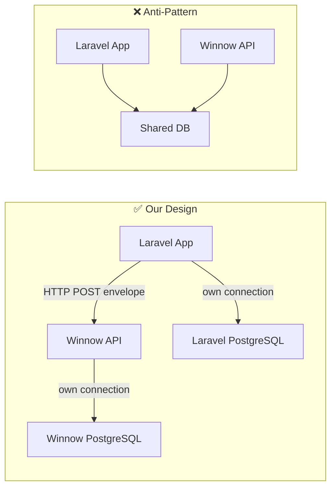
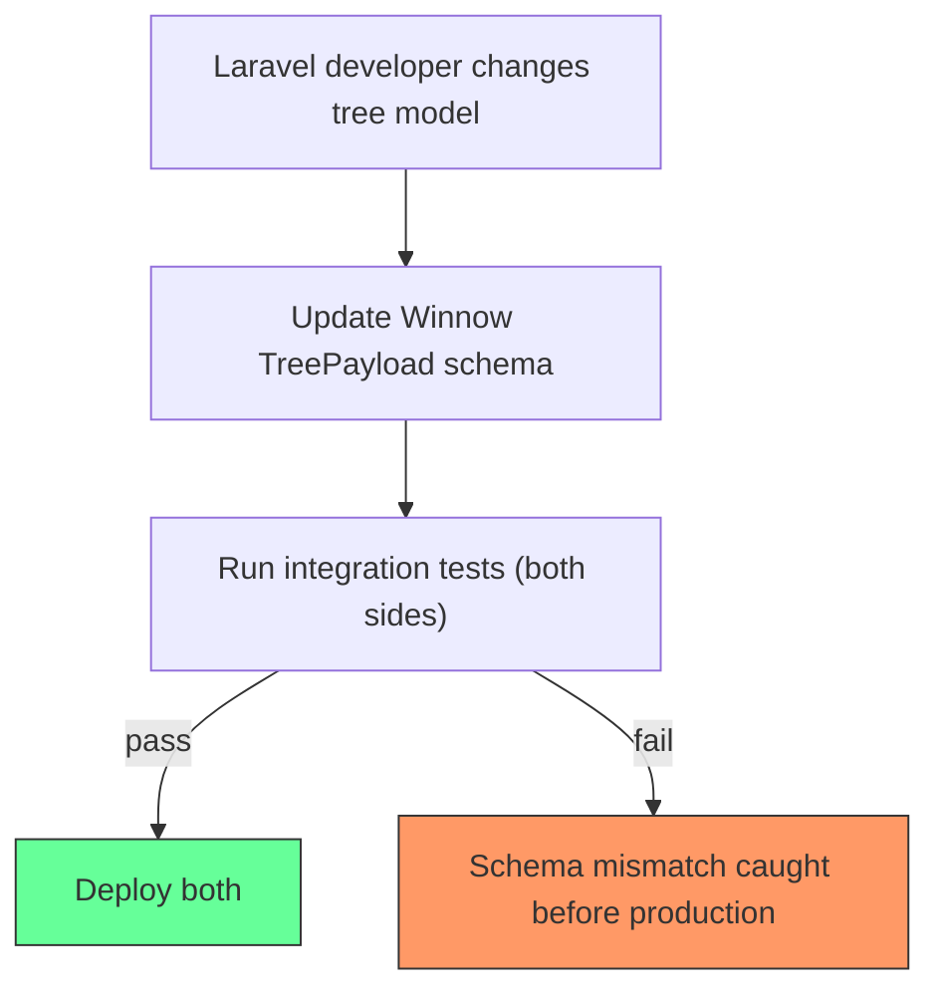
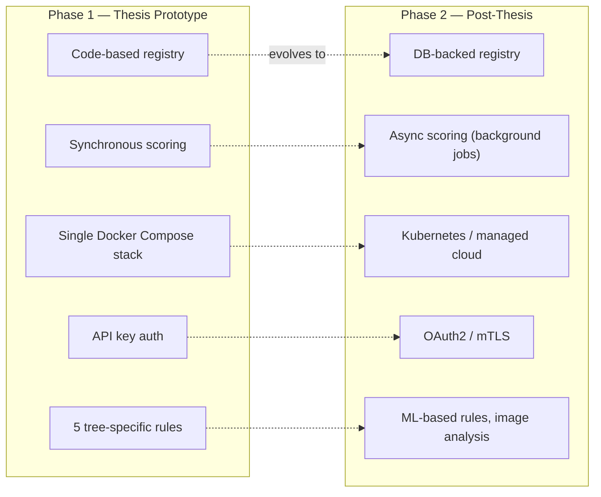

# 04 — Risk Analysis

> Architectural pitfalls, how we avoid them, and residual risks to monitor.

---

## Risk Matrix

| # | Risk | Severity | Likelihood | Mitigation |
|---|---|---|---|---|
| R1 | Distributed Monolith | 🔴 High | Medium | Strict contract boundaries, no shared DB |
| R2 | Tight Coupling to Laravel | 🔴 High | High | Envelope pattern, project-agnostic core |
| R3 | Stale User Context (Data on the Wire) | 🟡 Medium | Medium | Short-lived trust, timestamp checks |
| R4 | Payload Schema Drift | 🟡 Medium | Medium | Versioned contracts, integration tests |
| R5 | Single Point of Failure | 🟡 Medium | Low | Health checks, retries, circuit breaker |
| R6 | Over-Engineering for a Prototype | 🟡 Medium | Medium | YAGNI discipline, phased roadmap |
| R7 | Trust Score Manipulation | 🟡 Medium | Low | Server-side validation, audit log, Trust Advisor model |
| R8 | Performance Bottleneck in Scoring | 🟢 Low | Low | Async pipeline, future background jobs |
| R9 | Missing Finalization Signal | 🟡 Medium | Medium | Stale-submission monitoring, client reminders |
| R10 | Governance Over-Centralisation | 🟡 Medium | Low | Project-configurable policies, client override capability |

---

## Detailed Analysis

### R1 — Distributed Monolith

**What it is:** A system that has the deployment complexity of microservices but the coupling of a monolith. Services share databases, require coordinated deployments, or cannot function independently.

**How we avoid it:**

| Principle | Implementation |
|---|---|
| **Database-per-Service** | Winnow has its own PostgreSQL instance. It never reads from or writes to the Laravel database. |
| **Contract-first communication** | The only coupling is the JSON envelope schema. Both sides can change internals freely as long as the contract holds. |
| **Independent deployability** | Winnow can be deployed, scaled, and versioned independently of the Laravel app. |
| **No shared libraries** | No Python package is imported by the Laravel side and vice versa. Communication is purely over HTTP. |

---

### R2 — Tight Coupling to the Tree Project

**The risk:** If tree-specific logic leaks into the framework's core, Winnow becomes a "tree scoring service" rather than a generic QA framework — defeating the thesis goal.

**How we avoid it:**

| Layer | Allowed to know about trees? |
|---|---|
| `app/scoring/projects/trees/` | ✅ Yes — this is the designated place. |
| `app/scoring/common/` | ❌ No — only generic scoring factors (e.g., trust level, Trust Advisor). |
| `app/scoring/base.py` | ❌ No — abstract `ScoringRule` interface only. |
| `app/services/scoring_service.py` | ❌ No — works with `ScoringRule` abstraction. |
| `app/schemas/envelope.py` | ❌ No — payload is `dict[str, Any]`. |
| `app/schemas/projects/trees.py` | ✅ Yes — isolated payload schema. |
| `app/api/v1/submissions.py` | ❌ No — delegates to service layer. |

**Litmus test:** Can you delete the entire `trees/` folder and Winnow still compiles and runs (just without tree support)? If yes, coupling is correct.

---

### R3 — Stale User Context ("Data on the Wire" Problem)

**The risk:** Because user metadata (trust level, role) is sent by the client with every request rather than fetched from a central source, the data could be outdated or tampered with.

**Scenarios:**

| Scenario | Impact | Mitigation |
|---|---|---|
| User's trust level was lowered 5 minutes ago, but the cached client value is still high. | Over-scored submission. | Accept as a known trade-off for database separation. The scoring breakdown is persisted, so audits can retroactively flag affected submissions. |
| Malicious client sends fabricated high trust level. | Score manipulation. | **Service-to-service authentication** (API key / mTLS). Only trusted backend systems may call Winnow. End users never call Winnow directly. |
| Client sends an old `account_created_at` timestamp. | Minor scoring impact. | Low risk; this field changes only once. |

**Additional safeguard (Trust Advisor model):** Rather than syncing trust snapshots, Winnow now uses the **Trust Advisor** pattern: it accepts the client-provided `trust_level` for scoring (Stage 4 input) and returns a `trust_adjustment` recommendation after ground-truth finalization (Stage 4 output). Laravel remains the single owner of trust. This eliminates staleness as an architectural concern — any minor lag in the trust value sent on the wire is an acceptable trade-off, since the Trust Advisor's recommendations are based on Winnow's own ground-truth finalization data.

---

### R4 — Payload Schema Drift

**The risk:** The Laravel app changes its data model (e.g., adds a field, renames `trunk_diameter` to `dbh`) but forgets to update the Winnow payload — or vice versa.

**How we avoid it:**

1. **Contract-first design:** The envelope schema in `03_api_contracts.md` is the shared source of truth. Changes require updating the document first.
2. **Integration test suite:** A shared Pytest fixture containing sample payloads. If the schema changes, tests fail immediately.
3. **API versioning:** The `/api/v1/` prefix allows introducing breaking changes in `/api/v2/` while keeping v1 stable.
4. **`client_version` field:** Winnow can detect outdated clients and respond with a descriptive error.

---

### R5 — Single Point of Failure

**The risk:** If Winnow goes down, the Laravel app cannot validate submissions.

**How we avoid it:**

| Strategy | Detail |
|---|---|
| **Graceful degradation** | The Laravel app should handle Winnow unavailability by queuing submissions and retrying later (e.g., via Laravel Jobs). Submissions are not lost. |
| **Health endpoint** | `GET /health` enables Docker / orchestrator to detect failures and restart the container. |
| **Retry with backoff** | The Laravel HTTP client should use exponential backoff (built into Guzzle / Laravel HTTP). |
| **Circuit breaker (future)** | If Winnow fails repeatedly, the Laravel app stops calling it temporarily and falls back to "manual review" status. |
| **Horizontal scaling** | Winnow is stateless (all state is in PostgreSQL). Running multiple replicas behind a load balancer is trivial. |

---

### R6 — Over-Engineering for a Prototype

**The risk:** Spending too much time on infrastructure (Kubernetes, event sourcing, CQRS) instead of delivering the thesis deliverable: a working proof-of-concept integration with the tree app.

**How we avoid it:**

**Rule of thumb:** If a feature doesn't directly contribute to the Confidence Score calculation or the Laravel integration, defer it to Phase 2.

---

### R7 — Trust Score Manipulation

**The risk:** Since trust levels are sent by the client ("Data on the Wire"), a compromised or malicious client could inflate scores.

**Mitigations:**

1. **Server-to-server only.** Winnow's API is never exposed to end users. Only the Laravel backend (authenticated via API key) can call it.
2. **Audit trail.** Every submission stores the full `user_context` snapshot. Anomalies (e.g., trust level jumps) can be detected in post-hoc analysis.
3. **Trust Advisor cross-check.** Winnow derives its own user reliability metrics (approval rate, streaks) from its submissions table. If the `trust_level` sent on the wire diverges significantly from Winnow's observed reliability, submissions can be flagged for review.
4. **Rate limiting (future).** Limit submissions per user per time window.

---

### R8 — Performance Bottleneck in Scoring

**The risk:** As the number of rules or the complexity of individual rules (e.g., ML inference) grows, synchronous scoring may become too slow for a good user experience.

**Current stance:** For the prototype with ~5 lightweight rules, synchronous scoring will complete in milliseconds. This is a non-issue for Phase 1. Both the submission scoring and the finalization/Trust Advisor computation are synchronous request/response.

**Future mitigations (Phase 2):**

| Strategy | When to apply |
|---|---|
| **Async endpoints** | If p95 latency exceeds ~500ms. Accept with `202`, score in background, notify via webhook. |
| **Caching** | If the same payload is submitted multiple times (idempotency already handles this). |
| **Rule parallelism** | Run independent rules concurrently with `asyncio.gather`. |
| **Dedicated worker** | Offload heavy rules (ML) to a Celery/ARQ worker with a Redis queue. |

---

### R9 — Missing Finalization Signal

**The risk:** The client (Laravel) fails to send the `PATCH /submissions/{id}/final-status` signal after expert/community review. Without this signal, the submission remains `pending_finalization` indefinitely, and the Trust Advisor never computes a `trust_adjustment`.

**Impact:** Winnow's user reliability metrics (approval rate, streaks) become incomplete, degrading the quality of future trust recommendations.

**Mitigations:**

| Strategy | Detail |
|---|---|
| **Stale-submission monitoring** | A background query (or scheduled task) identifies submissions that have been `pending_finalization` for longer than a configurable threshold (e.g., 7 days). These can be surfaced via a dashboard endpoint or logged as warnings. |
| **Client reminder** | The `GET /results?status=pending_finalization` endpoint allows the client to query outstanding submissions and prompt reviewers. |
| **Auto-expiry (future)** | After a configurable period, submissions could be auto-finalized with a "timed_out" status that carries no trust adjustment. This prevents metric pollution. |
| **Graceful degradation** | The Trust Advisor still functions with partial data — it computes metrics based on whatever finalized submissions exist. Missing finalizations don't block the system. |

---

### R10 — Governance Over-Centralisation

**The risk:** By making Winnow the authoritative Governance Engine (owning submission lifecycle, review requirements, and task eligibility), there is a risk of over-centralising workflow logic. If Winnow goes down or its governance rules don't fit a new project's needs, the client project may be blocked.

**Mitigations:**

| Strategy | Detail |
|---|---|
| **Project-configurable governance** | Each project registers its own `GovernancePolicy` in the registry. New projects can define entirely different review tiers, trust thresholds, and role requirements. Winnow does not impose a one-size-fits-all workflow. |
| **Graceful degradation** | If Winnow is unavailable, the client can fall back to a "manual review all" mode (see R5). The `GET /tasks/available` endpoint is informational — the client can still render a basic review queue without it. |
| **Governance as advisory** | The `required_validations` in the response is metadata, not enforcement. The client decides whether to strictly follow it or apply its own overrides. The finalization endpoint accepts any `final_status` regardless of whether the required number of validators has been reached — enforcement is the client's responsibility. |
| **Clear ownership boundary** | Winnow owns the *validation process state* (scores, status, review requirements). Laravel owns the *domain data* (trees, users) and the *UI*. Neither crosses into the other's domain. |

---

## Architectural Decision Log

| Decision | Rationale | Alternative Considered |
|---|---|---|
| Separate Pydantic schemas from SQLAlchemy models | Prevents DB schema changes from breaking the API contract and vice versa. | Single model for both (rejected: creates tight coupling). |
| `payload` as `dict[str, Any]` in envelope | Enables dynamic, project-agnostic payloads without generics or union types at the API boundary. | Discriminated union per project (rejected: not scalable to N projects). |
| Synchronous request/response for scoring | Simplest approach; adequate for the prototype's ~5 lightweight rules. | Event-driven (rejected for Phase 1: added complexity without benefit). |
| Code-based validation registry | Fast to implement, easy to debug, sufficient for a single-project prototype. | DB-backed config (planned for Phase 2). |
| API key authentication | Minimal effort, adequate for a server-to-server prototype. | OAuth2 client credentials (planned for Phase 2). |
| UUID primary keys everywhere | Consistent with the Laravel tree-app (which uses UUIDs) and avoids sequential ID leaks. | Auto-increment integers (rejected: inconsistent with client system). |
| Laravel owns trust, Winnow advises | Single source of truth avoids dual-write consistency issues. Trust Advisor returns deltas as recommendations. | Winnow owns trust (rejected: sync complexity, dual-write problem). |
| Finalization-based trust adjustment | Trust deltas are computed from ground-truth decisions, not preliminary scores. Ensures high-quality recommendations. | Trust adjustment at scoring time (rejected: based on unverified scores). |
| Immutable submission snapshots | Winnow stores point-in-time submissions, not mutable entities. Data corrections trigger new submissions. | Mutable submissions (rejected: audit trail integrity, data drift). |
| Winnow as Governance Authority | Winnow owns the validation workflow state (status, review requirements, task eligibility). Centralising governance saves each client project from re-implementing complex "who can review what" logic. | Client-side governance (rejected: duplicated logic, inconsistent enforcement across projects). |
| `required_validations` as metadata | The governance Target State is returned in the response as advisory metadata, not enforced server-side. The client decides when to finalize. | Server-enforced validation counts (rejected: too rigid, blocks edge cases like admin overrides). |

---

## Questions & Assumptions

1. **Network topology:** Assumed that Laravel and Winnow run on the same Docker network (or can reach each other over a private network). No public internet exposure of Winnow's API is needed for the prototype.

2. **Data retention:** How long should Winnow keep submission records? Assumed indefinitely for the prototype; a retention policy should be defined for production.

3. **Concurrent submissions:** Assumed low concurrency for the prototype (< 10 req/s). No special locking or queue mechanisms needed. Connection pooling via `asyncpg` is sufficient.

4. **Error recovery:** If scoring fails mid-pipeline (e.g., a rule throws an exception), the submission should be persisted with status `error` and an error message, rather than returning a 500 to the client. This allows retry/debug without data loss.

5. **Backward compatibility:** When new rules are added to an existing project, old submissions (scored without those rules) are not re-scored automatically. This is acceptable for the prototype.

6. **Finalization coverage:** For the prototype, it is assumed that most submissions will eventually receive a finalization signal. The Trust Advisor's quality depends on finalization coverage — projects with low finalization rates will have less reliable trust recommendations. See R9.

7. **Governance enforcement:** The `required_validations` (Target State) is advisory metadata. Winnow does not enforce that N validators have reviewed a submission before accepting a finalization signal. The client project is responsible for enforcing its own review workflow before calling `PATCH /final-status`. This keeps Winnow flexible across diverse project workflows.

8. **Task query trust integrity:** The `GET /tasks/available` endpoint accepts `user_trust` and `user_role` as query parameters (sent by the client). The same manipulation risk as R7 applies — a compromised client could send inflated values. Mitigation is the same: server-to-server API key auth. End users never call Winnow directly.
