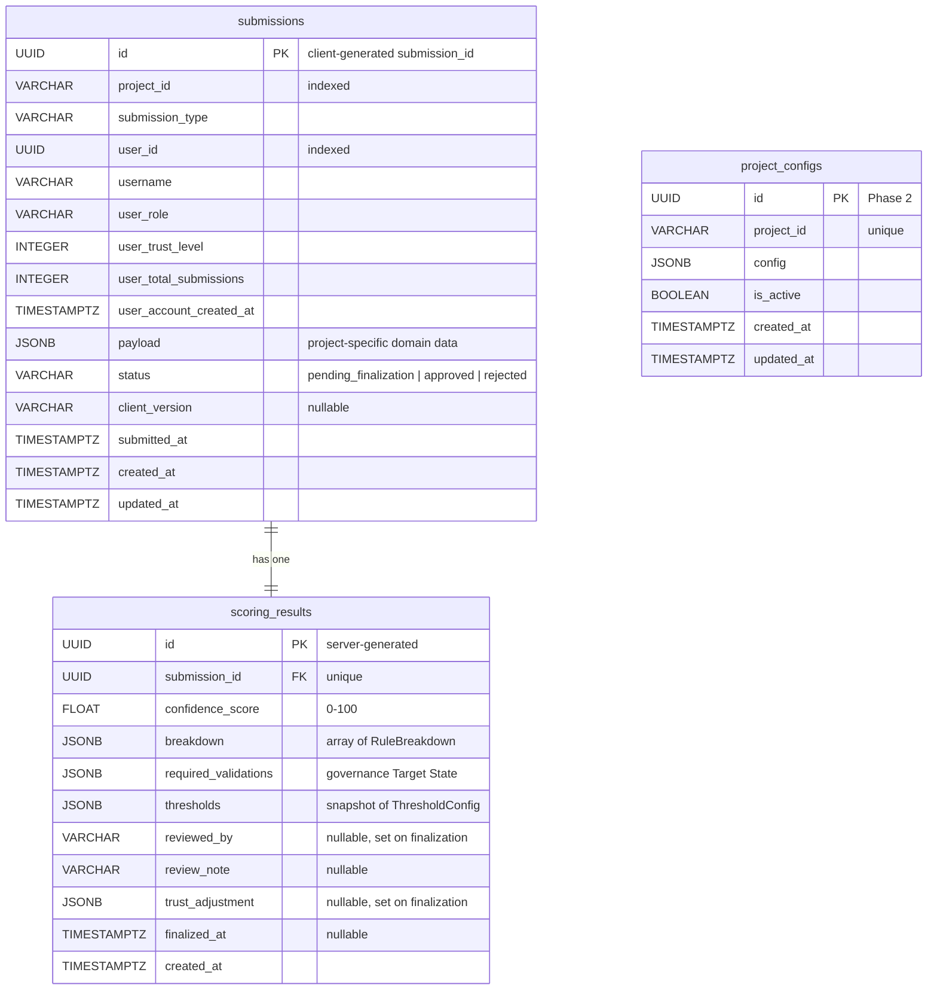
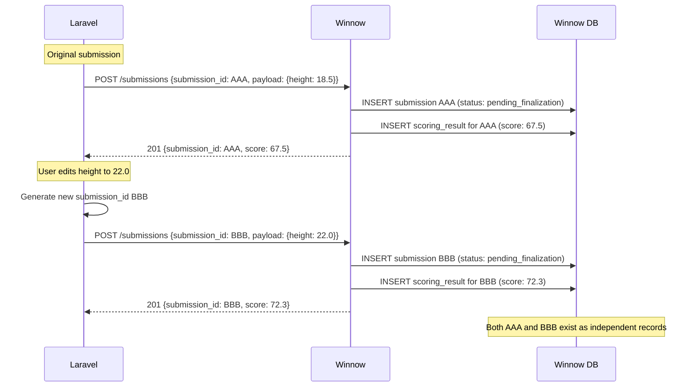
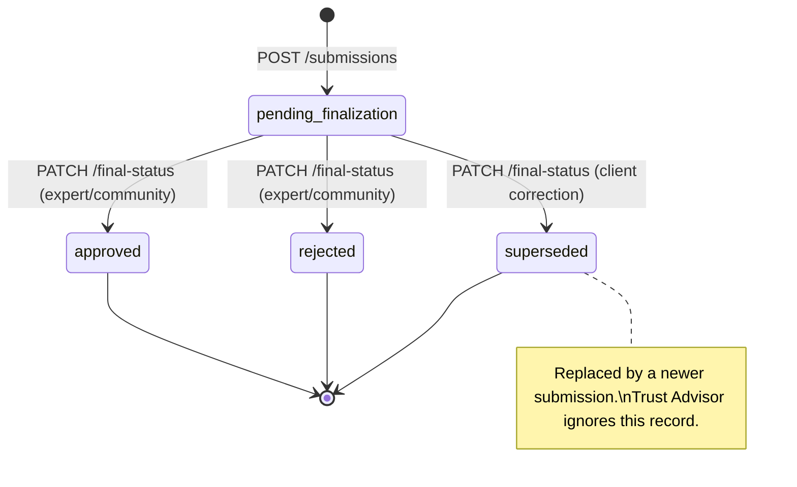

# 05 — Database Design & Edge Case Analysis

> Comprehensive planning document for Winnow's PostgreSQL persistence layer (Sprint 3).
> **No implementation code is included.** This document defines the schema, analyses edge cases, and records architectural decisions that will guide the SQLAlchemy 2.0 + Alembic implementation.

**Terminology reminder:** *"Validation"* = Stage 1 (Pydantic schema checks). *"Scoring"* = Stage 2 (Confidence Score factors). *"Trust Evaluation & Advisory"* = Stage 4 — dual role: (a) Tₙ as scoring input, (b) `trust_adjustment` recommendation after ground-truth finalization. See `01_project_structure.md` for the full convention.

---

## 1. Schema Design & Philosophy

### 1.1 Design Principles

| Principle | Rationale |
|---|---|
| **Domain Ownership** | Winnow stores only validation process state: submissions, scoring results, and project configuration. No tables for domain entities (trees, species) or users — those belong to the client (Laravel). See `01_project_structure.md` § Domain Ownership Principle. |
| **Immutable Submission Snapshots** | Submissions are point-in-time records. Data corrections in the client trigger a new submission, never an UPDATE to an existing row. This preserves audit integrity. See `03_api_contracts.md` §8 "Data corrections". |
| **JSONB for Dynamic Data** | Project-specific payloads, score breakdowns, and governance metadata vary per project. JSONB avoids per-project table proliferation while retaining queryability via GIN indexes. |
| **UUIDs as Primary Keys** | Consistent with the Laravel client (which uses UUIDs for all entities). Avoids sequential ID enumeration. Client-generated `submission_id` becomes the natural PK for submissions. |
| **Configuration from Code, Not DB (Phase 1)** | For the thesis prototype, all project configurations live in `ProjectBuilder` classes. The `project_configs` table is reserved for Phase 2 (DB-backed registry). See `02_architecture_patterns.md` §3. |
| **Timezone-Aware Timestamps** | All `TIMESTAMPTZ` columns — consistent with the `AwareDatetime` requirement enforced in Pydantic schemas. |

### 1.2 Proposed Tables

#### Table: `submissions`

The central table. Stores every envelope received by `POST /api/v1/submissions` as an immutable snapshot.

| Column | Type | Constraints | Description |
|---|---|---|---|
| `id` | `UUID` | `PK` | The client-generated `submission_id` from the envelope metadata. Using the client UUID as PK enables natural idempotency (see §2.2). |
| `project_id` | `VARCHAR` | `NOT NULL, INDEX` | Registered project identifier (e.g., `'tree-app'`). |
| `submission_type` | `VARCHAR` | `NOT NULL` | Submission variant within the project (e.g., `'tree_measurement'`). |
| `user_id` | `UUID` | `NOT NULL, INDEX` | Stable user identifier from the client system. Enables per-user history queries for the Trust Advisor. |
| `username` | `VARCHAR` | `NOT NULL` | Human-readable username snapshot at submission time. |
| `user_role` | `VARCHAR` | `NOT NULL` | User role snapshot at submission time. |
| `user_trust_level` | `INTEGER` | `NOT NULL` | Trust level snapshot as received on the wire. |
| `user_total_submissions` | `INTEGER` | `NOT NULL` | Cumulative submission count at submission time. |
| `user_account_created_at` | `TIMESTAMPTZ` | `NOT NULL` | Account creation timestamp snapshot. |
| `payload` | `JSONB` | `NOT NULL` | Raw domain data from the envelope. Stored as-is after Stage 1 validation passes. |
| `status` | `VARCHAR` | `NOT NULL, DEFAULT 'pending_finalization'` | Lifecycle state: `'pending_finalization'`, `'approved'`, `'rejected'`. |
| `client_version` | `VARCHAR` | `NULL` | Optional semver of the calling client. |
| `submitted_at` | `TIMESTAMPTZ` | `NOT NULL` | Client-reported submission timestamp from the envelope. |
| `created_at` | `TIMESTAMPTZ` | `NOT NULL, DEFAULT now()` | Server-side row creation timestamp. |
| `updated_at` | `TIMESTAMPTZ` | `NOT NULL, DEFAULT now()` | Server-side last-modification timestamp (set on status transitions). |

**Design choice — flattened `user_context` columns vs. JSONB:**

The `user_context` fields are flattened into typed columns rather than stored as a single JSONB blob. Rationale:

1. **Queryability.** The Trust Advisor needs `WHERE user_id = ? AND status = 'approved'` queries. Indexing a top-level UUID column is far more efficient than a JSONB path expression.
2. **Type safety.** `INTEGER` for trust level, `TIMESTAMPTZ` for timestamps — the database enforces constraints that JSONB cannot.
3. **Stability.** The `UserContext` schema is defined in `envelope.py` and is stable across all projects. Unlike `payload`, it does not vary per `project_id`.

The `payload` column remains JSONB because its structure varies per project and per `submission_type`.

#### Table: `scoring_results`

One-to-one relationship with `submissions`. Stores the output of the scoring pipeline and governance policy.

| Column | Type | Constraints | Description |
|---|---|---|---|
| `id` | `UUID` | `PK, DEFAULT gen_random_uuid()` | Server-generated surrogate key. |
| `submission_id` | `UUID` | `FK → submissions.id, UNIQUE, NOT NULL` | One scoring result per submission. |
| `confidence_score` | `FLOAT` | `NOT NULL, CHECK (0 <= val <= 100)` | Final weighted Confidence Score (0–100 scale). |
| `breakdown` | `JSONB` | `NOT NULL` | Array of `RuleBreakdown` objects: `[{rule, weight, score, weighted_score, details}]`. |
| `required_validations` | `JSONB` | `NOT NULL` | Governance Target State: `{min_validators, required_min_trust, required_role, review_tier}`. |
| `thresholds` | `JSONB` | `NOT NULL` | Snapshot of `ThresholdConfig` at scoring time: `{auto_approve_min, manual_review_min}`. |
| `reviewed_by` | `VARCHAR` | `NULL` | Who made the finalization decision (set on `PATCH /final-status`). |
| `review_note` | `VARCHAR` | `NULL` | Optional explanation from the reviewer. |
| `trust_adjustment` | `JSONB` | `NULL` | Trust Advisor output after finalization: `{user_id, recommended_delta, reason, ...}`. NULL until finalized. |
| `finalized_at` | `TIMESTAMPTZ` | `NULL` | When the finalization signal was received. NULL until finalized. |
| `created_at` | `TIMESTAMPTZ` | `NOT NULL, DEFAULT now()` | Row creation timestamp. |

**Design choice — separate `scoring_results` table vs. columns on `submissions`:**

Keeping scoring results in a separate table provides:

1. **Separation of concerns.** The submission is the *input* (envelope snapshot); the scoring result is the *output* (computed artefacts). They have different write patterns — the submission row is write-once; the scoring result row is written once then updated on finalization.
2. **Query flexibility.** Dashboard queries (`GET /results?status=...&score_gte=...`) can target `scoring_results` without loading heavy `payload` JSONB from `submissions`.
3. **Future extensibility.** If re-scoring is ever introduced (Phase 2), multiple scoring results per submission become possible without schema changes — just relax the `UNIQUE` constraint.

**Design choice — `breakdown` / `required_validations` / `thresholds` as JSONB:**

These fields are stored as JSONB rather than normalised into child tables because:

1. **They are always read and written as a unit.** No query ever needs "all submissions where rule X scored > 0.8" (that would be a reporting/analytics concern, not an operational one).
2. **Their internal structure varies per project.** Different projects have different rules, different numbers of breakdown entries, and potentially different governance fields.
3. **Normalisation cost is high, benefit is low.** A `rule_scores` child table would add N rows per submission (one per rule) with no operational query benefit. JSONB keeps writes atomic and reads efficient (single row fetch).

If future analytics require cross-submission rule-level queries, a materialised view or ETL pipeline over the JSONB data is the recommended approach — not schema normalisation.

#### Table: `project_configs` (Phase 2 — Future)

Reserved for the DB-backed registry. Not implemented in Sprint 3.

| Column | Type | Constraints | Description |
|---|---|---|---|
| `id` | `UUID` | `PK, DEFAULT gen_random_uuid()` | Surrogate key. |
| `project_id` | `VARCHAR` | `UNIQUE, NOT NULL` | Registered project identifier. |
| `config` | `JSONB` | `NOT NULL` | Full project configuration: weights, thresholds, trust advisor config, governance tiers. |
| `is_active` | `BOOLEAN` | `NOT NULL, DEFAULT TRUE` | Soft-disable without deleting configuration. |
| `created_at` | `TIMESTAMPTZ` | `NOT NULL, DEFAULT now()` | Row creation timestamp. |
| `updated_at` | `TIMESTAMPTZ` | `NOT NULL, DEFAULT now()` | Last modification timestamp. |

### 1.3 Entity-Relationship Diagram



### 1.4 Index Strategy

| Table | Index | Type | Purpose |
|---|---|---|---|
| `submissions` | `ix_submissions_project_id` | B-Tree | Filter by project for task queries and dashboards. |
| `submissions` | `ix_submissions_user_id` | B-Tree | Per-user history for Trust Advisor (`WHERE user_id = ? AND status IN ('approved', 'rejected')`). |
| `submissions` | `ix_submissions_status_project` | B-Tree (composite) | `(project_id, status)` — the primary query path for `GET /tasks/available` (find `pending_finalization` submissions per project). |
| `scoring_results` | `ix_scoring_results_submission_id` | B-Tree (unique) | FK lookup + enforce 1:1 relationship. Automatically created by the `UNIQUE` constraint. |
| `scoring_results` | `ix_scoring_results_confidence_score` | B-Tree | Range queries for dashboards (`WHERE confidence_score >= X`). |

**JSONB GIN indexes — deferred:**

GIN indexes on `payload` or `breakdown` are **not** created initially. Rationale:

1. No current query path requires JSONB containment or key-existence operators on these columns.
2. GIN indexes are expensive to maintain on write-heavy columns.
3. If analytics queries emerge in Phase 2, targeted GIN indexes or expression indexes (e.g., on `payload->>'tree_id'`) can be added via Alembic migration without downtime.

### 1.5 Challenge: Global Table vs. Per-Project Tables

**Current plan:** A single global `submissions` table with `project_id` as a discriminator column.

**Alternative considered:** One `submissions_<project>` table per project (e.g., `submissions_tree_app`).

| Criterion | Global Table | Per-Project Tables |
|---|---|---|
| **Schema simplicity** | ✅ One table, one model, one migration | ❌ Dynamic table creation, dynamic ORM mapping |
| **Cross-project queries** | ✅ Simple `SELECT ... WHERE project_id = ?` | ❌ Requires `UNION ALL` across N tables |
| **Write isolation** | ❌ All projects share locks/vacuums | ✅ Independent vacuuming and bloat control |
| **Prototype suitability** | ✅ Minimal complexity | ❌ Over-engineered for single-project thesis |
| **Scaling path** | Partition by `project_id` when needed | Already partitioned by design |

**Decision:** Global table for Phase 1. If Winnow serves many high-volume projects in production, PostgreSQL declarative table partitioning by `project_id` can be introduced transparently (the application code sees a single logical table). This avoids premature complexity while preserving a clear scaling path.

---

## 2. Flows & Edge Case Analysis

### 2.1 Project Registration Collisions

**Scenario:** A developer deploys two `ProjectBuilder` classes with the same `project_id`, or `bootstrap.py` is called twice (e.g., in tests).

**Current behaviour:** `Registry.load()` silently overwrites the previous entry (line 80 of `manager.py`: `self._entries[builder.project_id] = builder.build()`). The docstring notes this is "idempotent re-registration is safe during tests."

**Analysis:**

| Sub-case | Risk | Severity |
|---|---|---|
| Same builder loaded twice (test re-run) | None — idempotent. Same config replaces itself. | 🟢 Low |
| Two *different* builders claim the same `project_id` | Silent data corruption — the second builder's config wins. Submissions scored under the first config's rules are now served by different rules. | 🔴 High |
| DB-backed config (Phase 2) conflicts with code-based builder | Ambiguous source of truth. | 🟡 Medium |

**Proposed solution:**

1. **Bootstrap-time collision detection.** During `bootstrap()`, maintain a set of loaded `project_id` values. If a second builder attempts to register the same `project_id`, log a `CRITICAL` error with both class names and **skip the second builder**. The first-registered-wins policy prevents silent overwrites.

2. **`Registry.load()` guard.** Add an optional `allow_overwrite: bool = False` parameter. In production bootstrap, call with `allow_overwrite=False` (raises `ValueError` on collision). In test fixtures, call with `allow_overwrite=True` (permits idempotent re-registration).

3. **DB layer (Phase 2).** The `project_configs` table enforces `UNIQUE(project_id)` at the database level. An `INSERT` collision triggers an `IntegrityError` that the service layer translates to a descriptive error.

### 2.2 Idempotency & Network Retries

**Scenario:** Laravel sends `POST /submissions` with `submission_id = X`. The network drops before Laravel receives the `201` response. Laravel retries with the identical envelope (same UUID).

**Proposed solution — INSERT-or-return pattern:**

```text
1. BEGIN TRANSACTION
2. SELECT * FROM submissions WHERE id = :submission_id FOR UPDATE
3. IF row exists:
     a. Load associated scoring_result
     b. COMMIT
     c. Return existing ScoringResultResponse (with 200 OK, not 201)
4. ELSE:
     a. Run Stage 1 → Stage 2 → Governance pipeline
     b. INSERT INTO submissions (...)
     c. INSERT INTO scoring_results (...)
     d. COMMIT
     e. Return new ScoringResultResponse (with 201 Created)
```

**Key design decisions:**

| Decision | Rationale |
|---|---|
| Use client-generated UUID as the PK | The `submission_id` from the envelope naturally serves as the idempotency key. No need for a separate idempotency-key header or table. |
| `SELECT ... FOR UPDATE` before INSERT | Prevents race conditions where two concurrent retries both pass the existence check. The row-level lock ensures only one proceeds to INSERT. |
| Return `200` for duplicate, `201` for new | The client can distinguish "already processed" from "newly created" without error handling. Both responses carry the same `ScoringResultResponse` body. |
| No TTL / expiry on idempotency | Since submissions are immutable and stored indefinitely, the idempotency guarantee is permanent. No cleanup job needed. |

**Edge case — same UUID, different payload:**

If the client sends the same `submission_id` with a different payload (a bug, not a retry), Winnow returns the original result and logs a `WARNING`. The payload is **not** compared — the UUID alone determines identity. Comparing payloads would be expensive (JSONB deep-equality) and unnecessary if the client correctly treats `submission_id` as a unique submission identifier.

### 2.3 Edits & The Append-Only / Immutable Pattern

**Scenario:** A citizen scientist submits a tree measurement. Later, they correct the height from 18.5m to 22.0m in the Laravel UI. Laravel generates a new `submission_id` and sends a new `POST /submissions` to Winnow.

**How it works:**



**What happens to the old submission (AAA)?**

| Approach | Description | Chosen? |
|---|---|---|
| **Do nothing** | AAA remains `pending_finalization` forever. The Trust Advisor's per-user stats include it, potentially skewing metrics. | ❌ |
| **Laravel finalizes AAA as `rejected`** | Laravel sends `PATCH /submissions/AAA/final-status {rejected}` before or after sending BBB. This closes AAA's lifecycle cleanly and the Trust Advisor processes it as a rejection. | ❌ Unfair — the user corrected their own data, this is not a quality failure. |
| **Introduce a `superseded` status** | A new terminal status that means "replaced by a newer submission." The Trust Advisor ignores `superseded` submissions (they carry no trust signal). Laravel sends a dedicated request to mark AAA as `superseded`. | ✅ Recommended |

**Proposed `superseded` mechanism:**

1. **Extend the status enum** to include `superseded` as a terminal state alongside `approved` and `rejected`.
2. **New optional field on finalization:** `superseded_by: UUID | None` — the `submission_id` of the replacement submission. Stored on the `submissions` row for audit traceability.
3. **Trust Advisor behaviour:** Submissions with `status = 'superseded'` are excluded from approval-rate and streak calculations. They are neutral — neither reward nor penalty.
4. **Task query behaviour:** `superseded` submissions are excluded from `GET /tasks/available` results.
5. **Client responsibility:** Laravel is responsible for calling `PATCH /submissions/AAA/final-status {status: "superseded", superseded_by: "BBB"}` when a correction is made. Winnow does not auto-detect corrections (it has no knowledge of domain-level entity identity like `tree_id`).

**Updated status lifecycle:**



### 2.4 Concurrent Database Writes — Race Conditions

#### 2.4.1 Concurrent Duplicate Submissions

Covered by §2.2 (`SELECT ... FOR UPDATE` pattern). The row-level pessimistic lock ensures at most one transaction proceeds to INSERT.

#### 2.4.2 Concurrent Finalization Attempts

**Scenario:** Two reviewers simultaneously send `PATCH /submissions/{id}/final-status` — one with `approved`, one with `rejected`.

**Proposed solution — optimistic locking with status guard:**

```text
1. BEGIN TRANSACTION
2. SELECT status FROM submissions WHERE id = :id FOR UPDATE
3. IF status != 'pending_finalization':
     a. COMMIT
     b. Return 409 Conflict (already-finalized)
4. ELSE:
     a. UPDATE submissions SET status = :final_status, updated_at = now()
     b. Compute Trust Advisor adjustment
     c. UPDATE scoring_results SET trust_adjustment = ..., finalized_at = now(), reviewed_by = ..., review_note = ...
     d. COMMIT
     e. Return 200 OK
```

The `FOR UPDATE` lock on the submission row serialises concurrent finalization attempts. The first transaction to acquire the lock wins; the second sees `status != 'pending_finalization'` and receives a `409 Conflict`.

**Idempotent finalization:** If the same `final_status` is sent twice (a retry), the second attempt also hits the `409` path. However, per `03_api_contracts.md` §8.5, finalization should be idempotent. The refined logic:

```text
3. IF status == :final_status (same status re-sent):
     → Return existing FinalizationResponse (200 OK, idempotent)
   ELIF status != 'pending_finalization' (different status):
     → Return 409 Conflict (already finalized with a different status)
```

#### 2.4.3 Submission Received During Finalization

**Scenario:** A new `POST /submissions` arrives while a `PATCH /final-status` is being processed for a different submission by the same user. The Trust Advisor's `user_history` query could see inconsistent data.

**Risk assessment:** 🟢 Low. The Trust Advisor queries aggregate stats (approval count, streak length). A single in-flight finalization causing a slightly stale count is an acceptable trade-off — the delta will be ±1 at most, and the next finalization will correct it. No special locking is needed.

#### 2.4.4 Orphaned Scoring Results

**Scenario:** The application crashes between `INSERT INTO submissions` and `INSERT INTO scoring_results`.

**Solution:** Both inserts occur within a single database transaction. If the transaction is interrupted, both are rolled back. The client retries and the idempotency logic (§2.2) finds no existing row, proceeding with a clean insert of both records.

### 2.5 JSONB Data Integrity

**Scenario:** A future code change or migration corrupts the `breakdown` JSONB, making it unparseable by the `ScoringResultResponse` Pydantic schema.

**Mitigations:**

| Strategy | Detail |
|---|---|
| **Application-level validation** | Data is always written through Pydantic models (`RuleBreakdown`, `RequiredValidations`, `ThresholdConfig`) which enforce structural correctness before persistence. Raw JSONB is never written by hand. |
| **Read-time validation** | When loading scoring results for API responses, the service layer deserialises JSONB through the same Pydantic models. Corrupt data triggers a `ValidationError` that is caught and logged rather than silently served. |
| **Schema versioning (future)** | If the `RuleBreakdown` shape changes, a `schema_version` integer column on `scoring_results` can be added. The read path selects the correct deserialiser based on version. For Phase 1, the schema is stable enough that this is unnecessary. |

### 2.6 Trust Advisor — User History Aggregation

**Scenario:** The Trust Advisor needs per-user submission stats (approval rate, consecutive approval streak, total finalized count). These are derived from the `submissions` table, not a separate users table (Rule 5: no user tables in Winnow).

**Query strategy:**

```sql
-- Per-user finalized submission stats for Trust Advisor
SELECT
    COUNT(*) FILTER (WHERE status = 'approved') AS approved_count,
    COUNT(*) FILTER (WHERE status = 'rejected') AS rejected_count,
    COUNT(*) FILTER (WHERE status IN ('approved', 'rejected')) AS total_finalized
FROM submissions
WHERE user_id = :user_id
  AND project_id = :project_id
  AND status IN ('approved', 'rejected');  -- excludes 'superseded' and 'pending_finalization'
```

**Streak calculation:** The consecutive approval streak requires ordering by `submitted_at` and scanning backwards until the first non-`approved` status. This is computed in Python after fetching the user's recent finalized submissions (ordered by `submitted_at DESC`, limited to a configurable window).

**Performance note:** The composite index `(user_id, project_id, status)` would accelerate these queries. However, for the prototype (low cardinality), the existing `ix_submissions_user_id` index is sufficient. A composite index can be added if profiling reveals a bottleneck.

### 2.7 Stale `pending_finalization` Submissions

**Scenario:** Submissions that never receive a finalization signal accumulate over time (see Risk R9 in `04_risk_analysis.md`).

**Database-level support:**

1. **No auto-expiry in Phase 1.** The application does not auto-finalize stale submissions. This keeps the prototype simple and avoids opinionated TTL defaults.
2. **Monitoring query:** A simple `SELECT COUNT(*), MIN(created_at) FROM submissions WHERE status = 'pending_finalization' AND created_at < now() - interval '7 days'` can be exposed via the health endpoint or a dedicated admin endpoint.
3. **Phase 2 extension:** An optional `expired` terminal status and a background task that transitions stale submissions after a configurable TTL (per-project, from `project_configs`).

### 2.8 Clock Skew Between Client and Server

**Scenario:** The `submitted_at` timestamp in the envelope is generated by the Laravel server. The `created_at` timestamp in Winnow's DB is generated by PostgreSQL. If the clocks are skewed, `submitted_at > created_at` is possible.

**Impact:** Minor — both timestamps are stored independently. `submitted_at` is the client's assertion of when the data was collected; `created_at` is when Winnow received it. Queries that need ordering should use `created_at` (server-authoritative) for consistency.

**Mitigation:** Document the convention: `submitted_at` = client time, `created_at` = server time. No clock synchronisation is enforced.

### 2.9 Large JSONB Payloads

**Scenario:** A client sends an unusually large payload (e.g., hundreds of photos with long notes).

**Mitigations:**

1. **Pydantic Stage 1 validation** already enforces structural constraints (e.g., `photos: list[TreePhotoPayload]` with bounded fields). This implicitly limits payload size per project.
2. **Web server body size limit.** Configure a maximum request body size (e.g., 1 MB) at the Caddy reverse proxy or FastAPI level.
3. **PostgreSQL TOAST.** JSONB values exceeding ~2 KB are automatically compressed and stored out-of-line by PostgreSQL's TOAST mechanism. No special handling needed.

### 2.10 Concurrent Bootstrap in Multi-Worker Deployments

**Scenario:** When running multiple Uvicorn workers (e.g., `--workers 4`), each worker calls `bootstrap()` independently. The in-memory registry is per-process — this is correct and intentional (no shared state between workers).

**Risk:** None for the code-based registry (Phase 1). Each worker builds identical `ProjectRegistryEntry` objects from the same `ProjectBuilder` classes.

**Phase 2 risk (DB-backed registry):** If `bootstrap()` reads config from the database, all workers see the same data (PostgreSQL handles concurrent reads). Config updates would require a worker restart or a cache-invalidation mechanism (e.g., polling interval).

---

## 3. Architecture Decision Records (ADRs)

### ADR-DB-001: Client-Generated UUID as Submission Primary Key

| Field | Value |
|---|---|
| **Status** | Accepted |
| **Context** | Submissions arrive with a client-generated `submission_id` (UUID). We need to choose between using this as the PK or generating a server-side surrogate key. |
| **Decision** | Use the client-generated `submission_id` as the primary key of the `submissions` table. |
| **Rationale** | (1) Natural idempotency — `INSERT ... ON CONFLICT (id) DO NOTHING` or `SELECT ... FOR UPDATE` eliminates the need for a separate idempotency-key table. (2) Consistent with the Laravel client, which uses UUIDs for all entity IDs. (3) Avoids a secondary unique index on `submission_id` (which would be needed if we used a surrogate PK). |
| **Consequences** | Winnow trusts the client to generate unique UUIDs. A UUID collision (astronomically unlikely with UUIDv4) would be treated as a duplicate submission, not an error. The client must generate a new UUID for each genuinely new submission. |

### ADR-DB-002: JSONB for Dynamic Payloads and Score Breakdowns

| Field | Value |
|---|---|
| **Status** | Accepted |
| **Context** | Submission payloads vary per project. Score breakdowns vary per project (different rules, different counts). We need a storage strategy that accommodates this variability. |
| **Decision** | Store `payload`, `breakdown`, `required_validations`, `thresholds`, and `trust_adjustment` as `JSONB` columns. |
| **Rationale** | (1) Avoids per-project table proliferation — adding a new project requires zero schema migrations. (2) JSONB supports efficient containment queries and GIN indexing if needed later. (3) These fields are always read/written as a unit — no partial-column queries in the operational path. (4) PostgreSQL TOAST handles large values transparently. |
| **Trade-offs** | (1) No DB-level enforcement of JSONB internal structure (mitigated by Pydantic validation at the application level). (2) Cross-submission analytics on individual rule scores require JSONB path expressions or materialised views (acceptable for Phase 1). |
| **Alternatives Rejected** | (1) Normalised `rule_scores` child table — adds N rows per submission with no operational benefit. (2) EAV (Entity-Attribute-Value) pattern — poor query performance and no type safety. (3) Per-project tables — dynamic DDL is fragile and incompatible with SQLAlchemy's declarative model. |

### ADR-DB-003: Separate `scoring_results` Table (1:1 with `submissions`)

| Field | Value |
|---|---|
| **Status** | Accepted |
| **Context** | Scoring results could be stored as additional columns on the `submissions` table or in a separate table. |
| **Decision** | Use a separate `scoring_results` table with a `UNIQUE` foreign key to `submissions`. |
| **Rationale** | (1) Separation of input (envelope snapshot) from output (computed score). (2) Different write patterns — submissions are write-once; scoring results are written then updated on finalization. (3) Cleaner ORM mapping — the `Submission` model stays focused on the envelope; the `ScoringResult` model owns all computed fields. (4) Future extensibility — relaxing the `UNIQUE` constraint enables re-scoring without schema migration. |
| **Consequences** | Queries that need both submission metadata and scoring data require a JOIN. This is a single-row JOIN on an indexed FK — negligible cost. |

### ADR-DB-004: Optimistic Idempotency via `SELECT ... FOR UPDATE`

| Field | Value |
|---|---|
| **Status** | Accepted |
| **Context** | Network retries can cause duplicate `POST /submissions` requests with the same `submission_id`. |
| **Decision** | Use `SELECT ... FOR UPDATE` to check for an existing submission before inserting. Return the existing result for duplicates. |
| **Rationale** | (1) The client-generated UUID is the natural idempotency key (see ADR-DB-001). (2) `FOR UPDATE` serialises concurrent attempts without deadlocks (single-row lock). (3) No separate idempotency-key table or cache needed. (4) The idempotency guarantee is permanent (submissions are never deleted). |
| **Alternatives Rejected** | (1) `INSERT ... ON CONFLICT DO NOTHING` + re-SELECT — viable but loses the ability to distinguish "new" from "duplicate" in a single transaction without an additional query. (2) Redis-based idempotency cache with TTL — adds infrastructure complexity and a temporal expiry that contradicts the immutable-snapshots philosophy. |

### ADR-DB-005: `superseded` Status for Edited Submissions

| Field | Value |
|---|---|
| **Status** | Proposed |
| **Context** | When a user corrects data in the client, a new submission is sent to Winnow. The old submission remains in `pending_finalization`, which pollutes Trust Advisor metrics and the review queue. |
| **Decision** | Introduce `superseded` as a terminal submission status. The client calls `PATCH /final-status` with `{status: "superseded", superseded_by: "<new_id>"}` to cleanly close the old submission's lifecycle. |
| **Rationale** | (1) Preserves audit integrity — the old submission and its score remain readable. (2) Does not penalise the user — `superseded` carries no trust signal (excluded from approval rate and streak calculations). (3) Keeps the review queue clean — `superseded` submissions are excluded from task queries. (4) Explicit client action required — Winnow does not auto-detect corrections, respecting domain ownership boundaries. |
| **Consequences** | (1) The status `CHECK` constraint must include `superseded`. (2) The `FinalizationRequest` schema gains an optional `superseded_by: UUID | None` field. (3) The `submissions` table gains an optional `superseded_by: UUID | None` FK column (self-referential). (4) Trust Advisor queries must filter `WHERE status IN ('approved', 'rejected')`. |

### ADR-DB-006: Pessimistic Locking for Finalization (Prevent Double-Finalize)

| Field | Value |
|---|---|
| **Status** | Accepted |
| **Context** | Two concurrent `PATCH /final-status` requests for the same submission could both read `status = 'pending_finalization'` and proceed, creating a race condition where the Trust Advisor runs twice with inconsistent inputs. |
| **Decision** | Use `SELECT ... FOR UPDATE` on the submission row before checking and updating its status. |
| **Rationale** | (1) Serialises concurrent finalization attempts at the row level. (2) The first transaction wins; the second sees the updated status and returns `409 Conflict` (or `200 OK` if idempotent same-status retry). (3) Lock scope is a single row — no table-level contention. |
| **Consequences** | Finalization requests for the *same* submission are serialised (acceptable — this is rare). Finalization requests for *different* submissions proceed in parallel (row-level locks do not interfere). |

### ADR-DB-007: Single Global `submissions` Table with Future Partitioning Path

| Field | Value |
|---|---|
| **Status** | Accepted |
| **Context** | Multiple projects will share the Winnow instance. Should submissions be stored in a single table or per-project tables? |
| **Decision** | Single global `submissions` table with `project_id` as a discriminator column. |
| **Rationale** | (1) Simplest ORM mapping — one `Submission` model, one Alembic migration. (2) Cross-project queries (admin dashboards, health monitoring) are trivial. (3) PostgreSQL declarative partitioning by `project_id` can be introduced transparently if needed — the application code sees a single logical table. (4) For the thesis prototype with a single project, per-project tables would add complexity with zero benefit. |
| **Scaling Path** | When Winnow serves multiple high-volume projects, introduce `PARTITION BY LIST (project_id)` via Alembic migration. Each partition is independently vacuumed and can be stored on different tablespaces. The application layer requires no changes. |

---

## 4. Migration Strategy

### 4.1 Alembic Configuration

- **Async driver:** Use `asyncpg` via SQLAlchemy's `create_async_engine`. Alembic's `env.py` will use `run_async()` to execute migrations.
- **Autogenerate:** Enable Alembic autogenerate against the `Base.metadata` from `app/models/base.py`.
- **Naming convention:** Use SQLAlchemy's `MetaData(naming_convention=...)` to produce deterministic, human-readable constraint names (e.g., `pk_submissions`, `fk_scoring_results_submission_id`, `ix_submissions_project_id`).

### 4.2 Initial Migration (Sprint 3)

The first migration creates:
1. `submissions` table with all columns and indexes.
2. `scoring_results` table with FK, unique constraint, and indexes.
3. Status `CHECK` constraint: `status IN ('pending_finalization', 'approved', 'rejected', 'superseded')`.
4. `confidence_score` `CHECK` constraint: `0 <= confidence_score <= 100`.

The `project_configs` table is **not** created in Sprint 3 (Phase 2 scope).

### 4.3 Rollback Safety

Every migration must include a `downgrade()` function that cleanly reverses the schema change. For the initial migration, `downgrade()` drops both tables (safe because there is no production data yet).

---

## 5. SQLAlchemy Model Design Notes

### 5.1 Base Model Mixin

A `TimestampMixin` in `app/models/base.py` provides `created_at` and `updated_at` columns to all models, using `server_default=func.now()` and `onupdate=func.now()`.

A `UUIDPrimaryKeyMixin` provides `id: Mapped[uuid.UUID]` with `server_default=func.gen_random_uuid()` for server-generated keys (used by `scoring_results`).

The `submissions` table does **not** use the UUID mixin because its PK is client-generated (no server default).

### 5.2 Status as a Python Enum

Define a `SubmissionStatus` Python `enum.StrEnum`:

```text
class SubmissionStatus(StrEnum):
    PENDING_FINALIZATION = "pending_finalization"
    APPROVED = "approved"
    REJECTED = "rejected"
    SUPERSEDED = "superseded"
```

Map this to a `VARCHAR` column (not a PostgreSQL `ENUM` type). Rationale: PostgreSQL native enums require an `ALTER TYPE ... ADD VALUE` migration to extend, which cannot run inside a transaction. VARCHAR with a CHECK constraint is easier to migrate.

### 5.3 Relationship Mapping

```text
Submission.scoring_result  →  relationship("ScoringResult", back_populates="submission", uselist=False)
ScoringResult.submission   →  relationship("Submission", back_populates="scoring_result")
```

`uselist=False` enforces the 1:1 cardinality at the ORM level, complementing the `UNIQUE` constraint at the database level.

---

## 6. Summary — What This Document Enables

This document provides the complete blueprint for Sprint 3 implementation:

| Artefact | Section |
|---|---|
| Table definitions (columns, types, constraints) | §1.2 |
| Index strategy | §1.4 |
| ER diagram | §1.3 |
| Idempotency implementation | §2.2 |
| Edit/correction handling (`superseded` status) | §2.3 |
| Race condition mitigations | §2.4 |
| Trust Advisor query patterns | §2.6 |
| Alembic migration plan | §4 |
| SQLAlchemy model design notes | §5 |
| Formal ADRs for all decisions | §3 |

**Next step:** Implement `app/models/base.py`, `app/models/submission.py`, `app/models/scoring_result.py`, `app/db/session.py`, and the initial Alembic migration — following the schema and decisions documented here.
