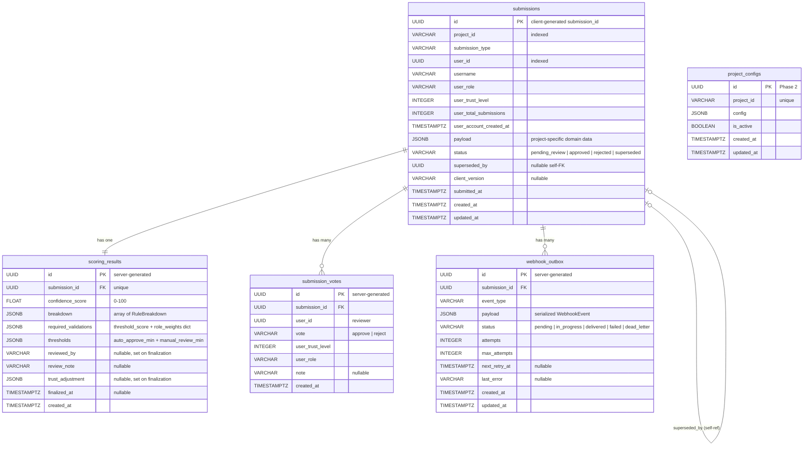
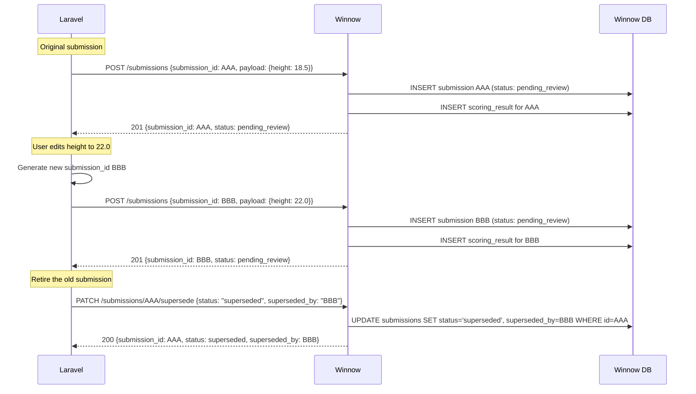
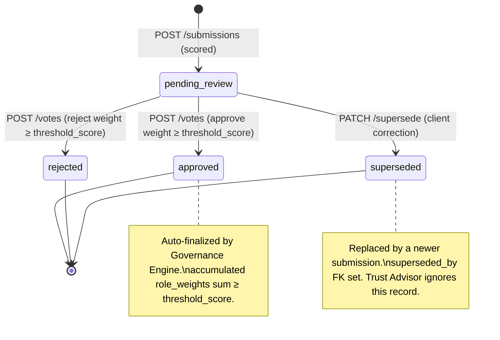

# 05 — Database Design & Edge Case Analysis

> Comprehensive planning document for Winnow's PostgreSQL persistence layer (Sprint 3).
> **No implementation code is included.** This document defines the schema, analyses edge cases, and records architectural decisions that will guide the SQLAlchemy 2.0 + Alembic implementation.
>
> **Last updated:** Sprint 3 Phase 2 — `confidence_score` relocated from `submissions` to `scoring_results` (ADR-DB-008); infra alignment: `ALEMBIC_CONFIG` env var, project-root-relative `script_location`, `dev_venv` volume removed, PostgreSQL port exposed in `compose.dev.yaml`.

**Terminology reminder:** *"Validation"* = Stage 1 (Pydantic schema checks). *"Scoring"* = Stage 2 (Confidence Score factors). *"Trust Evaluation & Advisory"* = Stage 4 — dual role: (a) Tₙ as scoring input, (b) `trust_adjustment` recommendation after ground-truth finalization. See `01_project_structure.md` for the full convention.

---

## 1. Schema Design & Philosophy

### 1.1 Design Principles

| Principle | Rationale |
|---|---|
| **Domain Ownership** | Winnow stores only validation process state: submissions, scoring results, and project configuration. No tables for domain entities (trees, species) or users — those belong to the client (Laravel). See `01_project_structure.md` § Domain Ownership Principle. |
| **Immutable Submission Snapshots** | Submissions are point-in-time records. Data corrections in the client trigger a new submission, never an UPDATE to an existing row. This preserves audit integrity. See `03_api_contracts.md` §8 "Data corrections". |
| **JSONB for Dynamic Data** | Project-specific payloads, score breakdowns, and governance metadata vary per project. JSONB avoids per-project table proliferation while retaining queryability via GIN indexes. |
| **UUIDs as Primary Keys** | Consistent with the Laravel client (which uses UUIDs for all entities). Avoids sequential ID enumeration. Client-generated `submission_id` becomes the natural PK for submissions. |
| **Configuration from Code, Not DB (Phase 1)** | For the thesis prototype, all project configurations live in `ProjectBuilder` classes. The `project_configs` table is reserved for Phase 2 (DB-backed registry). See `02_architecture_patterns.md` §3. |
| **Timezone-Aware Timestamps** | All `TIMESTAMPTZ` columns — consistent with the `AwareDatetime` requirement enforced in Pydantic schemas. |

### 1.2 Table Definitions

#### Table: `submissions`

The central table. Stores every envelope received by `POST /api/v1/submissions` as an immutable snapshot.

| Column | Type | Constraints | Description |
|---|---|---|---|
| `id` | `UUID` | `PK` | The client-generated `submission_id` from the envelope metadata. Using the client UUID as PK enables natural idempotency (see §2.2). |
| `project_id` | `VARCHAR` | `NOT NULL, INDEX` | Registered project identifier (e.g., `'tree-app'`). |
| `submission_type` | `VARCHAR` | `NOT NULL` | Submission variant within the project (e.g., `'tree_measurement'`). |
| `user_id` | `UUID` | `NOT NULL, INDEX` | Stable user identifier from the client system. Enables per-user history queries for the Trust Advisor. |
| `username` | `VARCHAR` | `NOT NULL` | Human-readable username snapshot at submission time. |
| `user_role` | `VARCHAR` | `NOT NULL` | User role snapshot at submission time. |
| `user_trust_level` | `INTEGER` | `NOT NULL` | Trust level snapshot as received on the wire. |
| `user_total_submissions` | `INTEGER` | `NOT NULL` | Cumulative submission count at submission time. |
| `user_account_created_at` | `TIMESTAMPTZ` | `NOT NULL` | Account creation timestamp snapshot. |
| `payload` | `JSONB` | `NOT NULL` | Raw domain data from the envelope. Stored as-is after Stage 1 validation passes. |
| `status` | `VARCHAR` | `NOT NULL, DEFAULT 'pending_review', CHECK IN ('pending_review', 'approved', 'rejected', 'superseded')` | Lifecycle state. `pending_review` is the initial state for all new submissions entering the Governance Engine vote flow. See §1.2 — Status Lifecycle for a full description of each state. |
| `superseded_by` | `UUID` | `NULL, FK → submissions.id` | Self-referential FK. Set when a submission is retired via `PATCH /supersede`. Points to the replacement submission's UUID. NULL for all other statuses. |
| `client_version` | `VARCHAR` | `NULL` | Optional semver of the calling client. |
| `submitted_at` | `TIMESTAMPTZ` | `NOT NULL` | Client-reported submission timestamp from the envelope. |
| `created_at` | `TIMESTAMPTZ` | `NOT NULL, DEFAULT now()` | Server-side row creation timestamp. |
| `updated_at` | `TIMESTAMPTZ` | `NOT NULL, DEFAULT now()` | Server-side last-modification timestamp (set on status transitions). |

**Status lifecycle:**

| Status | Description | Terminal? |
|---|---|---|
| `pending_review` | Initial state. Submission is scored and awaiting reviewer votes via the Governance Engine. | No |
| `approved` | Auto-finalized by Governance Engine when accumulated approve-vote weight ≥ `threshold_score`. | Yes |
| `rejected` | Auto-finalized by Governance Engine when accumulated reject-vote weight ≥ `threshold_score`. | Yes |
| `superseded` | Retired by explicit client action (`PATCH /supersede`). Replaced by a corrected submission identified by `superseded_by`. Excluded from Trust Advisor calculations and review queues. | Yes |

> **Note on `pending_finalization`:** The `ScoringResultResponse` Pydantic schema retains `pending_finalization` as a permitted status value for backward-compatibility with pre-Sprint-2.6 responses. It is not stored in the database for new submissions. All new rows use `pending_review`.

**Design choice — flattened `user_context` columns vs. JSONB:**

The `user_context` fields are flattened into typed columns rather than stored as a single JSONB blob. Rationale:

1. **Queryability.** The Trust Advisor needs `WHERE user_id = ? AND status = 'approved'` queries. Indexing a top-level UUID column is far more efficient than a JSONB path expression.
2. **Type safety.** `INTEGER` for trust level, `TIMESTAMPTZ` for timestamps — the database enforces constraints that JSONB cannot.
3. **Stability.** The `UserContext` schema is defined in `envelope.py` and is stable across all projects. Unlike `payload`, it does not vary per `project_id`.

The `payload` column remains JSONB because its structure varies per project and per `submission_type`.

---

#### Table: `scoring_results`

One-to-one relationship with `submissions`. Stores the output of the scoring pipeline and governance policy.

| Column | Type | Constraints | Description |
|---|---|---|---|
| `id` | `UUID` | `PK, DEFAULT gen_random_uuid()` | Server-generated surrogate key. |
| `submission_id` | `UUID` | `FK → submissions.id, UNIQUE, NOT NULL` | One scoring result per submission. |
| `confidence_score` | `FLOAT` | `NOT NULL, CHECK (0 <= val <= 100)` | Final weighted Confidence Score (0–100 scale). |
| `breakdown` | `JSONB` | `NOT NULL` | Array of `RuleBreakdown` objects: `[{rule, weight, score, weighted_score, details}]`. |
| `required_validations` | `JSONB` | `NOT NULL` | Governance Target State snapshot: `{threshold_score, role_weights, required_min_trust, review_tier}`. `threshold_score` (int) is the minimum accumulated role-weight sum to trigger finalization. `role_weights` (dict[str, int]) maps reviewer role → weight per vote, replacing the old `min_validators`/`required_role` pattern. See `RequiredValidations` in `app/schemas/results.py`. |
| `thresholds` | `JSONB` | `NOT NULL` | Snapshot of `ThresholdConfig` at scoring time: `{auto_approve_min, manual_review_min}` (both integers on the 0–100 scale). |
| `reviewed_by` | `VARCHAR` | `NULL` | Identity of the last reviewer/actor that triggered finalization. Set on vote-threshold auto-finalization. |
| `review_note` | `VARCHAR` | `NULL` | Optional explanation from the reviewer. |
| `trust_adjustment` | `JSONB` | `NULL` | Trust Advisor output after finalization: `{user_id, recommended_delta, reason, ...}`. NULL until finalized. |
| `finalized_at` | `TIMESTAMPTZ` | `NULL` | When the finalization signal was received. NULL until finalized. |
| `created_at` | `TIMESTAMPTZ` | `NOT NULL, DEFAULT now()` | Row creation timestamp. |

**Design choice — separate `scoring_results` table vs. columns on `submissions`:**

Keeping scoring results in a separate table provides:

1. **Separation of concerns.** The submission is the *input* (envelope snapshot); the scoring result is the *output* (computed artefacts). They have different write patterns — the submission row is write-once (plus status transitions); the scoring result row is written once then updated on finalization.
2. **Query flexibility.** Dashboard queries (`GET /results?status=...&score_gte=...`) can target `scoring_results` without loading heavy `payload` JSONB from `submissions`.
3. **Future extensibility.** If re-scoring is ever introduced (Phase 2), multiple scoring results per submission become possible without schema changes — just relax the `UNIQUE` constraint.

**Design choice — `breakdown` / `required_validations` / `thresholds` as JSONB:**

These fields are stored as JSONB rather than normalised into child tables because:

1. **They are always read and written as a unit.** No query ever needs "all submissions where rule X scored > 0.8" (that would be a reporting/analytics concern, not an operational one).
2. **Their internal structure varies per project.** Different projects have different rules, different numbers of breakdown entries, and potentially different governance fields.
3. **Normalisation cost is high, benefit is low.** A `rule_scores` child table would add N rows per submission (one per rule) with no operational query benefit. JSONB keeps writes atomic and reads efficient (single row fetch).

If future analytics require cross-submission rule-level queries, a materialised view or ETL pipeline over the JSONB data is the recommended approach — not schema normalisation.

---

#### Table: `submission_votes`

Stores individual reviewer votes. One row per (submission, voter) pair. Introduced in Sprint 2.6 (Governance Engine upgrade). See `03_api_contracts.md` §9 for the full voting flow.

| Column | Type | Constraints | Description |
|---|---|---|---|
| `id` | `UUID` | `PK, DEFAULT gen_random_uuid()` | Server-generated surrogate key. |
| `submission_id` | `UUID` | `FK → submissions.id, NOT NULL` | The submission being voted on. |
| `user_id` | `UUID` | `NOT NULL` | Reviewer's stable user identifier from the client system. |
| `vote` | `VARCHAR` | `NOT NULL, CHECK IN ('approve', 'reject')` | The reviewer's decision. |
| `user_trust_level` | `INTEGER` | `NOT NULL` | Reviewer's trust level at vote time (from wire). |
| `user_role` | `VARCHAR` | `NOT NULL` | Reviewer's role at vote time (from wire). |
| `note` | `VARCHAR` | `NULL` | Optional reviewer comment. |
| `created_at` | `TIMESTAMPTZ` | `NOT NULL, DEFAULT now()` | When the vote was recorded. |

**Constraints:**
- `UNIQUE(submission_id, user_id)` — prevents duplicate votes. A reviewer may vote only once per submission.
- `FK(submission_id) → submissions(id)` — referential integrity.

**Design notes:**
- Votes are **immutable** — once cast, a vote cannot be changed or retracted. This preserves audit integrity.
- `user_trust_level` and `user_role` are snapshots at vote time (Data on the Wire pattern). Threshold evaluation always uses the reviewer's state at the moment they voted, not a live lookup.
- Threshold evaluation uses the **role-weights pattern**: the voting service sums `role_weights[user_role]` for all eligible votes (trust gate + weight gate); finalization triggers when the accumulated weight ≥ `threshold_score`. See `03_api_contracts.md` §9.2 for the full algorithm.

---

#### Table: `webhook_outbox`

Implements the Transactional Outbox pattern for guaranteed webhook delivery. See `03_api_contracts.md` §10.3 for the full pattern.

| Column | Type | Constraints | Description |
|---|---|---|---|
| `id` | `UUID` | `PK, DEFAULT gen_random_uuid()` | Server-generated surrogate key. |
| `submission_id` | `UUID` | `FK → submissions.id, NOT NULL` | The submission that triggered the webhook. |
| `event_type` | `VARCHAR` | `NOT NULL` | Event identifier, e.g. `'submission.finalized'`. |
| `payload` | `JSONB` | `NOT NULL` | Full `WebhookEvent` payload to deliver, serialized from `app/schemas/webhooks.py`. |
| `status` | `VARCHAR` | `NOT NULL, DEFAULT 'pending', CHECK IN ('pending', 'in_progress', 'delivered', 'failed', 'dead_letter')` | Delivery state. Mirrors `OutboxStatus` in `app/services/webhook_service.py`. |
| `attempts` | `INTEGER` | `NOT NULL, DEFAULT 0` | Number of delivery attempts made so far. |
| `max_attempts` | `INTEGER` | `NOT NULL` | Maximum attempts before moving to `dead_letter`. Sourced from project config. |
| `next_retry_at` | `TIMESTAMPTZ` | `NULL` | When the next retry should be attempted. NULL for `pending` and terminal states. |
| `last_error` | `VARCHAR` | `NULL` | Error message from the most recent failed attempt. |
| `created_at` | `TIMESTAMPTZ` | `NOT NULL, DEFAULT now()` | When the outbox entry was created. |
| `updated_at` | `TIMESTAMPTZ` | `NOT NULL, DEFAULT now()` | Last modification timestamp. |

**Design notes:**
- The outbox entry is **inserted atomically** in the same DB transaction that finalizes the submission status and scoring result. This guarantees no finalization occurs without a corresponding webhook delivery attempt.
- The `in_progress` status prevents concurrent outbox workers from picking up the same entry (acts as a distributed lock flag).
- The `dead_letter` status is a terminal state requiring manual intervention or automated alerting.

---

#### Table: `project_configs` (Phase 2 — Future)

Reserved for the DB-backed registry. Not implemented in Sprint 3. For Phase 1, all project configurations are code-based and live in `ProjectBuilder` classes.

| Column | Type | Constraints | Description |
|---|---|---|---|
| `id` | `UUID` | `PK, DEFAULT gen_random_uuid()` | Surrogate key. |
| `project_id` | `VARCHAR` | `UNIQUE, NOT NULL` | Registered project identifier. |
| `config` | `JSONB` | `NOT NULL` | Full project configuration: weights, thresholds, trust advisor config, governance tiers. |
| `is_active` | `BOOLEAN` | `NOT NULL, DEFAULT TRUE` | Soft-disable without deleting configuration. |
| `created_at` | `TIMESTAMPTZ` | `NOT NULL, DEFAULT now()` | Row creation timestamp. |
| `updated_at` | `TIMESTAMPTZ` | `NOT NULL, DEFAULT now()` | Last modification timestamp. |

---

### 1.3 Entity-Relationship Diagram



### 1.4 Index Strategy

| Table | Index | Type | Purpose |
|---|---|---|---|
| `submissions` | `ix_submissions_project_id` | B-Tree | Filter by project for task queries and dashboards. |
| `submissions` | `ix_submissions_user_id` | B-Tree | Per-user history for Trust Advisor (`WHERE user_id = ? AND status IN ('approved', 'rejected')`). |
| `submissions` | `ix_submissions_status_project` | B-Tree (composite) | `(project_id, status)` — primary query path for `GET /tasks/available` (find `pending_review` submissions per project). |
| `scoring_results` | `ix_scoring_results_submission_id` | B-Tree (unique) | FK lookup + enforce 1:1 relationship. Automatically created by the `UNIQUE` constraint. |
| `scoring_results` | `ix_scoring_results_confidence_score` | B-Tree | Range queries for dashboards (`WHERE confidence_score >= X`). |
| `submission_votes` | `uq_submission_votes_submission_user` | B-Tree (unique composite) | `(submission_id, user_id)` — enforces one vote per user per submission. Also serves as the primary lookup path. |
| `webhook_outbox` | `ix_webhook_outbox_status_next_retry` | B-Tree (composite) | `(status, next_retry_at)` — the outbox worker's polling query: `WHERE status IN ('pending', 'failed') AND next_retry_at <= now()`. |

**JSONB GIN indexes — deferred:**

GIN indexes on `payload` or `breakdown` are **not** created initially. Rationale:

1. No current query path requires JSONB containment or key-existence operators on these columns.
2. GIN indexes are expensive to maintain on write-heavy columns.
3. If analytics queries emerge in Phase 2, targeted GIN indexes or expression indexes (e.g., on `payload->>'tree_id'`) can be added via Alembic migration without downtime.

---

## 2. Flows & Edge Case Analysis

### 2.1 Project Registration Collisions

**Scenario:** A developer deploys two `ProjectBuilder` classes with the same `project_id`, or `bootstrap.py` is called twice (e.g., in tests).

**Current behaviour:** `Registry.load()` silently overwrites the previous entry (line 80 of `manager.py`: `self._entries[builder.project_id] = builder.build()`). The docstring notes this is "idempotent re-registration is safe during tests."

**Analysis:**

| Sub-case | Risk | Severity |
|---|---|---|
| Same builder loaded twice (test re-run) | None — idempotent. Same config replaces itself. | 🟢 Low |
| Two *different* builders claim the same `project_id` | Silent data corruption — the second builder's config wins. Submissions scored under the first config's rules are now served by different rules. | 🔴 High |
| DB-backed config (Phase 2) conflicts with code-based builder | Ambiguous source of truth. | 🟡 Medium |

**Proposed solution:**

1. **Bootstrap-time collision detection.** During `bootstrap()`, maintain a set of loaded `project_id` values. If a second builder attempts to register the same `project_id`, log a `CRITICAL` error with both class names and **skip the second builder**. The first-registered-wins policy prevents silent overwrites.

2. **`Registry.load()` guard.** Add an optional `allow_overwrite: bool = False` parameter. In production bootstrap, call with `allow_overwrite=False` (raises `ValueError` on collision). In test fixtures, call with `allow_overwrite=True` (permits idempotent re-registration).

3. **DB layer (Phase 2).** The `project_configs` table enforces `UNIQUE(project_id)` at the database level. An `INSERT` collision triggers an `IntegrityError` that the service layer translates to a descriptive error.

### 2.2 Idempotency & Network Retries

**Scenario:** Laravel sends `POST /submissions` with `submission_id = X`. The network drops before Laravel receives the `201` response. Laravel retries with the identical envelope (same UUID).

**Solution — `SELECT ... FOR UPDATE` insert-or-return pattern** (see ADR-DB-004):

```text
1. BEGIN TRANSACTION
2. SELECT * FROM submissions WHERE id = :submission_id FOR UPDATE
3. IF row exists:
     a. Load associated scoring_result
     b. COMMIT
     c. Return existing ScoringResultResponse (200 OK — duplicate)
4. ELSE:
     a. Run Stage 1 → Stage 2 → Governance pipeline
     b. INSERT INTO submissions (..., status='pending_review')
     c. INSERT INTO scoring_results (...)
     d. COMMIT
     e. Return new ScoringResultResponse (201 Created)
```

**Key design decisions:**

| Decision | Rationale |
|---|---|
| Use client-generated UUID as the PK | The `submission_id` from the envelope naturally serves as the idempotency key. No need for a separate idempotency-key header or table. |
| `SELECT ... FOR UPDATE` before INSERT | Prevents race conditions where two concurrent retries both pass the existence check. The row-level lock ensures only one proceeds to INSERT. |
| Return `200` for duplicate, `201` for new | The client can distinguish "already processed" from "newly created" without error handling. Both responses carry the same `ScoringResultResponse` body. |
| No TTL / expiry on idempotency | Since submissions are immutable and stored indefinitely, the idempotency guarantee is permanent. No cleanup job needed. |

**Edge case — same UUID, different payload:** If the client sends the same `submission_id` with a different payload (a bug, not a retry), Winnow returns the original result and logs a `WARNING`. The UUID alone determines identity.

### 2.3 Edits & The Append-Only / Immutable Pattern

**Scenario:** A citizen scientist submits a tree measurement. Later, they correct the height in the Laravel UI. Laravel generates a new `submission_id` and sends a new `POST /submissions`.



**`superseded` status — fully accepted design** (see ADR-DB-005):

1. `superseded` is a terminal status with a dedicated `PATCH /submissions/{id}/supersede` endpoint. It is **not** reachable via the voting/finalization flow.
2. `superseded_by` UUID column on `submissions` points to the replacement submission.
3. Trust Advisor excludes `superseded` submissions from approval-rate and streak calculations.
4. `GET /tasks/available` excludes `superseded` submissions from the review queue.

**Updated status lifecycle:**



### 2.4 Concurrent Database Writes — Race Conditions

#### 2.4.1 Concurrent Duplicate Submissions

Covered by §2.2 (`SELECT ... FOR UPDATE` pattern). The row-level pessimistic lock ensures at most one transaction proceeds to INSERT.

#### 2.4.2 Concurrent Finalization Attempts

**Scenario:** Two reviewers simultaneously send `POST /submissions/{id}/votes` — both approvals that would each independently trigger the threshold.

**Solution — `FOR UPDATE` status guard:**

```text
1. BEGIN TRANSACTION
2. SELECT status FROM submissions WHERE id = :id FOR UPDATE
3. IF status != 'pending_review':
     a. COMMIT
     b. Return 409 Conflict (already-finalized) — or 200 OK if same status (idempotent)
4. ELSE:
     a. INSERT INTO submission_votes (...)
     b. Evaluate accumulated weights vs threshold_score
     c. IF threshold met:
          - UPDATE submissions SET status = :final_status, updated_at = now()
          - UPDATE scoring_results SET trust_adjustment = ..., finalized_at = now()
          - INSERT INTO webhook_outbox (...) -- same transaction, Outbox pattern
     d. COMMIT
     e. Return VoteResponse
```

The `FOR UPDATE` lock serialises concurrent finalization. The first transaction wins; the second sees `status != 'pending_review'` and returns `409 Conflict`.

#### 2.4.3 Submission Received During Finalization

**Risk assessment:** 🟢 Low. The Trust Advisor queries aggregate stats over a user's history. A single in-flight finalization causing a ±1 stale count is an acceptable prototype trade-off. No special cross-submission locking is needed.

#### 2.4.4 Orphaned Scoring Results

**Scenario:** Application crash between `INSERT INTO submissions` and `INSERT INTO scoring_results`.

**Solution:** Both inserts occur within a single database transaction. A crash rolls back both. The client retries; the idempotency logic finds no existing row and proceeds cleanly.

### 2.5 JSONB Data Integrity

**Scenario:** A code change or migration corrupts the `breakdown` JSONB, making it unparseable by `ScoringResultResponse`.

| Strategy | Detail |
|---|---|
| **Application-level validation** | Data is always written through Pydantic models (`RuleBreakdown`, `RequiredValidations`, `ThresholdConfig`) which enforce structural correctness before persistence. |
| **Read-time validation** | When loading scoring results for API responses, the service layer deserialises JSONB through the same Pydantic models. Corrupt data triggers a `ValidationError` that is caught and logged. |
| **Schema versioning (future)** | A `schema_version` integer column on `scoring_results` can be added if the `RuleBreakdown` shape ever changes. For Phase 1, the schema is stable. |

### 2.6 Trust Advisor — User History Aggregation

**Scenario:** The Trust Advisor needs per-user submission stats (approval rate, consecutive approval streak, total finalized count) derived from the `submissions` table. No separate users table (Rule 5).

**Query strategy:**

```sql
-- Per-user finalized submission stats for Trust Advisor
SELECT
    COUNT(*) FILTER (WHERE status = 'approved') AS approved_count,
    COUNT(*) FILTER (WHERE status = 'rejected') AS rejected_count,
    COUNT(*) FILTER (WHERE status IN ('approved', 'rejected')) AS total_finalized
FROM submissions
WHERE user_id = :user_id
  AND project_id = :project_id
  AND status IN ('approved', 'rejected');  -- excludes 'superseded' and 'pending_review'
```

**Streak calculation:** The consecutive approval streak requires ordering by `submitted_at` and scanning backwards until the first non-`approved` status. This is computed in Python after fetching the user's recent finalized submissions (ordered by `submitted_at DESC`, limited to a configurable window).

**Performance note:** The composite index `(user_id, project_id, status)` would accelerate these queries. For the prototype (low cardinality), the existing `ix_submissions_user_id` index is sufficient. A composite index can be added if profiling reveals a bottleneck.

### 2.7 Stale `pending_review` Submissions

**Scenario:** Submissions that never receive enough votes accumulate over time.

1. **No auto-expiry in Phase 1.** The application does not auto-finalize stale submissions.
2. **Monitoring query:** `SELECT COUNT(*), MIN(created_at) FROM submissions WHERE status = 'pending_review' AND created_at < now() - interval '7 days'` can be exposed via the health or admin endpoint.
3. **Phase 2 extension:** An optional `expired` terminal status and a background task that transitions stale submissions after a configurable TTL sourced from `project_configs`.

### 2.8 Clock Skew Between Client and Server

**Scenario:** `submitted_at` is generated by the Laravel server; `created_at` is generated by PostgreSQL. Clock skew can make `submitted_at > created_at`.

**Convention:** `submitted_at` = client assertion of when data was collected. `created_at` = server-authoritative receipt time. Ordering queries must use `created_at`. No clock synchronisation enforced.

### 2.9 Large JSONB Payloads

**Mitigations:**
1. **Pydantic Stage 1 validation** enforces structural constraints (bounded field lists) before persistence.
2. **Web server body size limit.** Configured at the Caddy reverse proxy (or FastAPI middleware). Recommended: 1 MB max.
3. **PostgreSQL TOAST.** JSONB values exceeding ~2 KB are compressed and stored out-of-line automatically.

### 2.10 Concurrent Bootstrap in Multi-Worker Deployments

**Scenario:** Multiple Uvicorn workers each call `bootstrap()` independently. The in-memory registry is per-process — intentional. Each worker builds identical `ProjectRegistryEntry` objects from the same `ProjectBuilder` classes. No shared state required for Phase 1. See §2.1 for the Phase 2 DB-backed registry concern.

---

## 3. Architecture Decision Records (ADRs)

### ADR-DB-001: Client-Generated UUID as Submission Primary Key

| Field | Value |
|---|---|
| **Status** | Accepted |
| **Context** | Submissions arrive with a client-generated `submission_id` (UUID). |
| **Decision** | Use the client-generated `submission_id` as the PK of `submissions`. |
| **Rationale** | (1) Natural idempotency — `SELECT ... FOR UPDATE` eliminates a separate idempotency-key table. (2) Consistent with Laravel's UUID-first convention. (3) Avoids a secondary unique index. |
| **Consequences** | Winnow trusts the client to generate unique UUIDs. A UUIDv4 collision is astronomically unlikely and would be treated as a duplicate submission, not an error. |

### ADR-DB-002: JSONB for Dynamic Payloads and Score Breakdowns

| Field | Value |
|---|---|
| **Status** | Accepted |
| **Context** | Submission payloads and score breakdowns vary per project. |
| **Decision** | Store `payload`, `breakdown`, `required_validations`, `thresholds`, and `trust_adjustment` as `JSONB` columns. |
| **Rationale** | (1) No per-project table proliferation — adding a project requires zero schema migrations. (2) JSONB supports GIN indexing if needed later. (3) These fields are always read/written as a unit. (4) TOAST handles large values transparently. |
| **Trade-offs** | No DB-level structural enforcement inside JSONB (mitigated by Pydantic). Cross-submission analytics on rule scores require JSONB path expressions or materialised views. |
| **Rejected alternatives** | Normalised `rule_scores` child table (N rows per submission, no operational benefit); EAV pattern (poor performance, no type safety); per-project tables (dynamic DDL incompatible with declarative ORM). |

### ADR-DB-003: Separate `scoring_results` Table (1:1 with `submissions`)

| Field | Value |
|---|---|
| **Status** | Accepted |
| **Context** | Scoring results could be extra columns on `submissions` or in a separate table. |
| **Decision** | Separate `scoring_results` table with a `UNIQUE` FK to `submissions`. |
| **Rationale** | (1) Different write patterns — submissions are write-once (plus status updates); scoring results are written then updated on finalization. (2) Dashboard queries can target `scoring_results` without loading the heavy `payload` JSONB. (3) Future re-scoring just relaxes the `UNIQUE` constraint. |
| **Consequences** | Queries needing both submission metadata and scores require a JOIN. This is a single-row JOIN on an indexed FK — negligible cost. |

### ADR-DB-004: `SELECT ... FOR UPDATE` for Idempotency and Finalization Locking

| Field | Value |
|---|---|
| **Status** | Accepted |
| **Context** | Two patterns were considered for network-retry idempotency and concurrent finalization prevention. |
| **Decision** | Use `SELECT ... FOR UPDATE` in both the submission insert path (§2.2) and the vote/finalization path (§2.4.2). |
| **Rationale** | (1) The client-generated UUID is the natural idempotency key — no separate table or cache needed. (2) `FOR UPDATE` serialises concurrent attempts without deadlocks (single-row lock). (3) Enables distinguishing `200 OK` (duplicate) from `201 Created` (new) in one transaction. (4) Idempotency is permanent — no TTL or cleanup job needed. |
| **Rejected alternative — `INSERT ... ON CONFLICT DO NOTHING` + re-SELECT** | Viable for the submission insert, but loses the ability to distinguish new vs duplicate in one round-trip. Rejected for consistency: the finalization path always needs `FOR UPDATE` anyway, so using the same pattern in both places reduces cognitive load. |
| **Rejected alternative — Redis idempotency cache** | Adds infrastructure complexity and a temporal expiry (TTL) that contradicts the immutable-snapshots principle. |

### ADR-DB-005: `superseded` Status for Edited Submissions

| Field | Value |
|---|---|
| **Status** | Accepted — implemented in Sprint 2.6 |
| **Context** | When a user corrects domain data in the client, a new submission is sent to Winnow. The old submission must be cleanly retired without penalising the user. |
| **Decision** | `superseded` is a terminal status reachable only via `PATCH /submissions/{id}/supersede`. The `submissions` table carries a nullable `superseded_by UUID` self-referential FK pointing to the replacement. |
| **Rationale** | (1) Preserves audit integrity — the old submission and its score remain readable. (2) Does not penalise the user — `superseded` is excluded from Trust Advisor metrics. (3) Keeps the review queue clean — excluded from `GET /tasks/available`. (4) Explicit client action required — Winnow does not auto-detect corrections, respecting domain ownership boundaries (Rule 5). (5) Dedicated endpoint (`PATCH /supersede`) enforces a `Literal["superseded"]` request body, preventing accidental mis-use to approve/reject. |
| **Schema consequences** | (1) `CHECK` constraint includes `superseded`. (2) `submissions.superseded_by` is a nullable UUID FK (self-referential). (3) Trust Advisor queries filter `WHERE status IN ('approved', 'rejected')`. (4) Task queries filter `WHERE status = 'pending_review'`. |

### ADR-DB-006: Pessimistic Locking for Finalization (Prevent Double-Finalize)

| Field | Value |
|---|---|
| **Status** | Accepted |
| **Context** | Two concurrent `POST /votes` requests could both read `status = 'pending_review'` and both trigger the threshold. |
| **Decision** | Use `SELECT ... FOR UPDATE` on the submission row before checking and updating status in the vote-registration transaction. |
| **Rationale** | (1) Serialises concurrent finalization attempts at the row level. (2) First transaction wins; second sees updated status and returns `409 Conflict`. (3) Lock scope is a single row — no table-level contention. Requests for *different* submissions proceed in parallel. |
| **Consequences** | The outbox INSERT (webhook creation) is part of the same transaction as the status UPDATE, preserving the atomicity guarantee of the Transactional Outbox pattern. |

### ADR-DB-007: Single Global `submissions` Table with Future Partitioning Path

| Field | Value |
|---|---|
| **Status** | Accepted |
| **Context** | Multiple projects will share the Winnow instance. Per-project tables were considered. |
| **Decision** | Single global `submissions` table with `project_id` as a discriminator column. |
| **Rationale** | (1) One ORM model, one Alembic migration. (2) Cross-project admin queries are trivial. (3) PostgreSQL declarative partitioning by `project_id` can be added transparently via migration if volume demands it — the application layer requires zero changes. (4) For the thesis prototype with a single project, per-project tables add complexity with no benefit. |
| **Scaling path** | When Winnow serves multiple high-volume projects: `ALTER TABLE submissions PARTITION BY LIST (project_id)`. Each partition vacuums independently. Application code unchanged. |

### ADR-DB-008: `confidence_score` Stored in `scoring_results`, Not `submissions`

| Field | Value |
|---|---|
| **Status** | Accepted — implemented in Sprint 3 Phase 2 |
| **Context** | `confidence_score` is a computed output of the scoring pipeline. It could be stored as a column on `submissions` for query convenience, or in `scoring_results` alongside the rest of the pipeline output. |
| **Decision** | Store `confidence_score` exclusively in `scoring_results`. Remove it from the `submissions` table. |
| **Rationale** | (1) **Submission immutability.** The `submissions` table is a point-in-time INPUT snapshot of the received envelope. A computed OUTPUT field on an immutable row is semantically incorrect and creates an ambiguous write pattern. (2) **Future re-scoring.** Phase 2 may introduce re-scoring (e.g., updated rule weights). `scoring_results` is designed to hold multiple results per submission (relaxing the `UNIQUE` constraint). A `confidence_score` on `submissions` would become stale on re-score and require an UPDATE — violating the append-only principle. (3) **Separation of concerns.** All pipeline outputs (`breakdown`, `required_validations`, `thresholds`, `trust_adjustment`) already live in `scoring_results`. `confidence_score` is one more pipeline output and belongs with its siblings. |
| **Performance trade-off** | Dashboard and leaderboard queries that filter or sort by `confidence_score` now require a JOIN between `submissions` and `scoring_results`. This JOIN is on an indexed FK (`ix_scoring_results_submission_id`) and is efficient for prototype-scale workloads. Combined filters like `WHERE project_id = ? AND confidence_score >= ?` become a two-table query. |
| **Future mitigation** | If profiling reveals the JOIN is a bottleneck at scale, the following options are available without violating architectural principles: (1) a covering index on `(submission_id, confidence_score)` in `scoring_results`; (2) a PostgreSQL materialised view pre-joining the two tables, refreshed on a schedule or trigger; (3) explicit intentional denormalisation — a read-model `confidence_score` column on `submissions` alongside the canonical value in `scoring_results`, documented as a new ADR at that time. Architectural purity takes priority in the current phase. |
| **Consequences** | All service-layer code reads `confidence_score` from the `ScoringResult` ORM row (`sr_row.confidence_score`), never from `Submission`. The `CHECK (0 <= confidence_score <= 100)` constraint and `ix_scoring_results_confidence_score` index are both enforced on `scoring_results`. |

---

## 4. Migration Strategy

### 4.1 Alembic Configuration
- **Async driver:** Use `asyncpg` via SQLAlchemy's `create_async_engine`. Alembic's `env.py` will use `run_async()` to execute migrations.
- **Autogenerate:** Enable Alembic autogenerate against `Base.metadata` from `app/models/base.py`.
- **Naming convention:** Use SQLAlchemy's `MetaData(naming_convention=...)` to produce deterministic, human-readable constraint names (e.g., `pk_submissions`, `fk_scoring_results_submission_id`, `uq_submission_votes_submission_id_user_id`).
- **Config file location:** `alembic.ini` lives at `app/db/migrations/alembic.ini`. The `script_location` inside it is set to `app/db/migrations` (relative to the **project root**, not the config file). This means Alembic must always be invoked from the project root or via the `ALEMBIC_CONFIG` environment variable.
- **`ALEMBIC_CONFIG` env var:** Set `ALEMBIC_CONFIG=app/db/migrations/alembic.ini` in `.env` (and `.env.example`). This tells the Alembic CLI where to find its config regardless of the working directory. Example: `alembic upgrade head` works from the project root without a `-c` flag when `ALEMBIC_CONFIG` is exported.

### 4.4 Development Environment Notes
The following `compose.dev.yaml` changes were applied in Sprint 3 Phase 2 to align the dev environment with the production image and improve local DB access:

| Change | Rationale |
|---|---|
| **`dev_venv` volume removed** | The named volume was used to persist the Python virtual environment across container restarts. Removing it ensures dependencies are always sourced directly from the built image (`/opt/venv` baked in during `docker build`). This eliminates stale-dependency bugs caused by the volume shadowing the image's `site-packages`. |
| **PostgreSQL port `5432:5432` exposed** | The `db` service now publishes port 5432 to the host. This enables direct local DB access via `psql`, a GUI client (e.g., DataGrip), or `alembic upgrade head` run outside Docker without a tunnel. **Not** exposed in `compose.yaml` (production) — only in `compose.dev.yaml`. |

### 4.2 Initial Migration — Sprint 3 (All Four Tables)

The first Alembic migration creates all four Sprint 3 tables in dependency order:

**Step 1 — `submissions`:**
- All columns including `superseded_by UUID NULL`.
- `CHECK` constraint: `status IN ('pending_review', 'approved', 'rejected', 'superseded')`.
- Self-referential FK: `superseded_by → submissions.id` (deferred or nullable — no circular dependency issue since it's self-referential on nullable column).
- Indexes: `ix_submissions_project_id`, `ix_submissions_user_id`, `ix_submissions_status_project` (composite on `project_id, status`).

**Step 2 — `scoring_results`:**
- FK: `submission_id → submissions.id`.
- `UNIQUE` constraint on `submission_id` (enforces 1:1).
- `CHECK` constraint: `0 <= confidence_score <= 100`.
- Index: `ix_scoring_results_confidence_score`.

**Step 3 — `submission_votes`:**
- FK: `submission_id → submissions.id`.
- `UNIQUE` constraint: `(submission_id, user_id)`.
- `CHECK` constraint: `vote IN ('approve', 'reject')`.

**Step 4 — `webhook_outbox`:**
- FK: `submission_id → submissions.id`.
- `CHECK` constraint: `status IN ('pending', 'in_progress', 'delivered', 'failed', 'dead_letter')`.
- Composite index: `ix_webhook_outbox_status_next_retry` on `(status, next_retry_at)`.

The `project_configs` table is **not** created in Sprint 3 (Phase 2 scope).

### 4.3 Rollback Safety

Every migration includes a `downgrade()` function. For the initial migration, `downgrade()` drops all four tables in reverse dependency order: `webhook_outbox` → `submission_votes` → `scoring_results` → `submissions`. Safe because there is no production data yet.

---

## 5. SQLAlchemy Model Design Notes

### 5.1 Base Model Mixins

A `TimestampMixin` in `app/models/base.py` provides `created_at` and `updated_at` to all models using `server_default=func.now()` and `onupdate=func.now()`.

A `UUIDPrimaryKeyMixin` provides `id: Mapped[uuid.UUID]` with `server_default=text("gen_random_uuid()")` for server-generated keys (used by `scoring_results`, `submission_votes`, `webhook_outbox`).

The `submissions` table does **not** use the UUID mixin because its PK is client-generated (no server default).

### 5.2 Status as a Python StrEnum

```text
class SubmissionStatus(StrEnum):
    PENDING_REVIEW    = "pending_review"       # initial state (Governance Engine flow)
    APPROVED          = "approved"             # terminal — vote threshold met (approve)
    REJECTED          = "rejected"             # terminal — vote threshold met (reject)
    SUPERSEDED        = "superseded"           # terminal — replaced by corrected submission
```

Mapped to a `VARCHAR` column (not a PostgreSQL `ENUM` type). Rationale: PostgreSQL native enums require an `ALTER TYPE ... ADD VALUE` migration that cannot run inside a transaction. `VARCHAR` + `CHECK` constraint is easier to extend safely.

### 5.3 Relationship Mapping

```text
Submission.scoring_result  → relationship("ScoringResult", back_populates="submission", uselist=False)
ScoringResult.submission   → relationship("Submission", back_populates="scoring_result")

Submission.votes           → relationship("SubmissionVote", back_populates="submission")
SubmissionVote.submission  → relationship("Submission", back_populates="votes")

Submission.outbox_events   → relationship("WebhookOutbox", back_populates="submission")
WebhookOutbox.submission   → relationship("Submission", back_populates="outbox_events")
```

`uselist=False` on `Submission.scoring_result` enforces the 1:1 cardinality at the ORM level.

### 5.4 JSONB Column Typing

JSONB columns are typed as `Mapped[dict]` with `type_=JSONB` (from `sqlalchemy.dialects.postgresql`). Pydantic model serialisation/deserialisation (`.model_dump()` / `model_validate()`) is the application's responsibility at the service layer — the ORM stores and retrieves raw Python dicts.

---

## 6. Sprint 3 — Step-by-Step Implementation Plan

The following sequence defines the order in which Sprint 3 code will be written. Each step is independently testable.

| Step | Artefact | Description |
|---|---|---|
| **1** | `app/models/base.py` | `TimestampMixin`, `UUIDPrimaryKeyMixin`, `Base = DeclarativeBase()`, `MetaData` with naming convention. |
| **2** | `app/models/submission.py` | `Submission` ORM model. All columns from §1.2. `SubmissionStatus` StrEnum. Self-referential `superseded_by` FK. |
| **3** | `app/models/scoring_result.py` | `ScoringResult` ORM model. 1:1 FK to `submissions`. JSONB columns. `relationship` back-ref. |
| **4** | `app/models/submission_vote.py` | `SubmissionVote` ORM model. Composite unique constraint. |
| **5** | `app/models/webhook_outbox.py` | `WebhookOutbox` ORM model. `OutboxStatus` StrEnum. Composite index. |
| **6** | `app/db/session.py` | `create_async_engine`, `async_sessionmaker`, `get_db()` FastAPI dependency. `DATABASE_URL` from `app/core/config.py`. |
| **7** | Alembic initial migration | `alembic revision --autogenerate -m "initial_schema"`. Review generated script; add CHECK constraints manually (autogenerate does not emit `CheckConstraint`). |
| **8** | `app/services/submission_service.py` | Replace in-memory stub with DB `INSERT` (idempotency via `SELECT ... FOR UPDATE`). Atomic `submissions` + `scoring_results` insert in one transaction. |
| **9** | `app/services/voting_service.py` | Replace in-memory `_submissions` dict with DB reads/writes. Vote INSERT + threshold evaluation + conditional status UPDATE + outbox INSERT — all in one transaction (§2.4.2). |
| **10** | `app/services/supersede_service.py` | Replace in-memory supersede stub with DB `UPDATE submissions SET status='superseded', superseded_by=...`. |
| **11** | `app/services/webhook_service.py` | Implement outbox poller: `SELECT ... WHERE status IN ('pending','failed') AND next_retry_at <= now() FOR UPDATE SKIP LOCKED`. HTTP delivery + status update. |
| **12** | Integration tests | Replace `TestClient` in-memory tests with `pytest-asyncio` + `asyncpg` against a test DB. Cover idempotency, duplicate-vote rejection, concurrent finalization, and supersede flow. |
| **13** | Collision guard (`app/registry/manager.py`) | Add `allow_overwrite: bool = False` to `Registry.register()`. Bootstrap calls with `allow_overwrite=False` — raises `ValueError` on duplicate `project_id`. Test fixtures call with `allow_overwrite=True` for idempotent re-registration. Backed by `UNIQUE(project_id)` in `project_configs` (§2.1). |

---

## 7. Summary — What This Document Enables

| Artefact | Section |
|---|---|
| Table definitions (columns, types, constraints) | §1.2 |
| Index strategy | §1.4 |
| ER diagram | §1.3 |
| Status lifecycle (including `superseded`) | §1.2, §2.3 |
| Idempotency implementation (`SELECT ... FOR UPDATE`) | §2.2, ADR-DB-004 |
| Edit/correction handling (`superseded_by` FK) | §2.3, ADR-DB-005 |
| Race condition mitigations | §2.4 |
| Trust Advisor query patterns | §2.6 |
| Alembic migration plan (4 tables) | §4.2 |
| SQLAlchemy model design notes | §5 |
| Formal ADRs for all decisions (all Accepted) | §3 |
| Sprint 3 step-by-step implementation plan | §6 |
| `confidence_score` relocation rationale and trade-offs | ADR-DB-008 |
| Alembic `ALEMBIC_CONFIG` env var and `script_location` | §4.1 |
| Dev environment infra changes (`dev_venv`, PG port) | §4.4 |

**All architectural decisions are now in `Accepted` status. No open trade-offs remain. The codebase, migration, and documentation are fully synchronised.**
